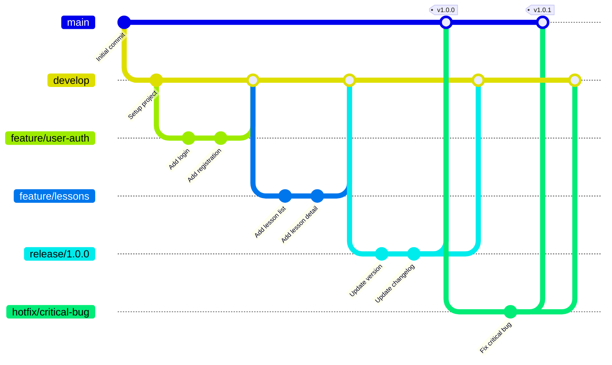

# Git Workflow - arQ (Quranic Arabic Grammar LMS)

**Version**: 1.0
**Last Updated**: 2025-11-03
**Owner**: DevOps Engineer + Solution Architect

---

## Table of Contents

1. [Branching Strategy](#branching-strategy)
2. [Branch Naming Conventions](#branch-naming-conventions)
3. [Commit Message Guidelines](#commit-message-guidelines)
4. [Pull Request Process](#pull-request-process)
5. [Code Review Guidelines](#code-review-guidelines)
6. [Merge Strategies](#merge-strategies)
7. [Release Process](#release-process)
8. [Hotfix Process](#hotfix-process)
9. [Git Hooks](#git-hooks)
10. [Common Git Commands](#common-git-commands)
11. [Troubleshooting](#troubleshooting)

---

## Branching Strategy

We follow **Git Flow** with modifications for modern CI/CD practices.

### Branch Types

```
main (production)
  ↓
develop (integration)
  ↓
feature/* (new features)
bugfix/* (bug fixes)
hotfix/* (production fixes)
release/* (release preparation)
```

### Branch Descriptions

| Branch | Purpose | Base Branch | Merge To | Lifetime |
|--------|---------|-------------|----------|----------|
| `main` | Production-ready code | - | - | Permanent |
| `develop` | Integration branch | `main` | `main` (via release) | Permanent |
| `feature/*` | New features | `develop` | `develop` | Temporary |
| `bugfix/*` | Bug fixes | `develop` | `develop` | Temporary |
| `hotfix/*` | Critical production fixes | `main` | `main` + `develop` | Temporary |
| `release/*` | Release preparation | `develop` | `main` + `develop` | Temporary |

### Branch Diagram



---

## Branch Naming Conventions

### Format

```
<type>/<ticket-id>-<short-description>
```

### Examples

```bash
# Features
feature/ARQ-123-user-authentication
feature/ARQ-456-lesson-filtering
feature/ARQ-789-gamification-system

# Bug fixes
bugfix/ARQ-234-fix-login-redirect
bugfix/ARQ-567-resolve-xp-calculation

# Hotfixes
hotfix/ARQ-890-critical-security-patch
hotfix/ARQ-901-fix-payment-gateway

# Releases
release/1.0.0
release/1.1.0
release/2.0.0-beta.1
```

### Rules

1. **Use lowercase**: All branch names must be lowercase
2. **Use hyphens**: Separate words with hyphens, not underscores
3. **Include ticket ID**: Always include Jira/Linear ticket ID (if applicable)
4. **Be descriptive**: Short but clear description (3-5 words max)
5. **No personal names**: Avoid using personal names in branches

**✅ GOOD**:
```bash
feature/ARQ-123-user-profile-page
bugfix/ARQ-456-fix-lesson-loading
```

**❌ BAD**:
```bash
feature/UserProfile  # No ticket ID, PascalCase
john-feature         # Personal name
fix                  # Not descriptive
feature/fix_bug      # Underscores instead of hyphens
```

---

## Commit Message Guidelines

We follow **Conventional Commits** specification.

### Format

```
<type>(<scope>): <subject>

<body>

<footer>
```

### Commit Types

| Type | Description | Example |
|------|-------------|---------|
| `feat` | New feature | `feat(auth): add user registration` |
| `fix` | Bug fix | `fix(lessons): resolve pagination issue` |
| `docs` | Documentation changes | `docs(api): update API documentation` |
| `style` | Code style (formatting, no logic) | `style(components): format with prettier` |
| `refactor` | Code refactoring | `refactor(services): extract lesson logic` |
| `perf` | Performance improvements | `perf(queries): optimize lesson queries` |
| `test` | Add/update tests | `test(auth): add login unit tests` |
| `chore` | Maintenance tasks | `chore(deps): upgrade next.js to 14.1` |
| `ci` | CI/CD changes | `ci(github): add test workflow` |
| `build` | Build system changes | `build(docker): update dockerfile` |
| `revert` | Revert previous commit | `revert: revert "feat(auth): add 2FA"` |

### Scope

The scope should indicate the affected module or feature:

- `auth` - Authentication/Authorization
- `lessons` - Lessons module
- `exercises` - Exercises module
- `progress` - User progress tracking
- `gamification` - XP, levels, achievements
- `analytics` - Analytics and reporting
- `api` - API endpoints
- `ui` - UI components
- `db` - Database changes
- `config` - Configuration

### Subject Line Rules

1. **Limit to 50 characters**: Keep it concise
2. **Use imperative mood**: "add" not "added", "fix" not "fixed"
3. **Don't capitalize first letter**: lowercase after type/scope
4. **No period at the end**: Don't end with a period
5. **Be descriptive**: Clearly state what the commit does

### Commit Message Examples

#### Simple Commit (No Body)

```
feat(auth): add user registration endpoint
```

#### Detailed Commit (With Body)

```
feat(progress): add XP calculation for exercise completion

- Calculate XP based on accuracy and difficulty level
- Update user progress in database transaction
- Emit XP_EARNED event for achievement system
- Add unit tests for XP calculation logic

Closes ARQ-123
```

#### Breaking Change

```
feat(api)!: change lesson response structure

BREAKING CHANGE: Lesson API now returns `titleArabic` instead of `title_arabic`

Migration guide:
- Update frontend to use `titleArabic` field
- Update mobile app to use `titleArabic` field

Closes ARQ-456
```

#### Bug Fix

```
fix(lessons): resolve pagination not working on lesson list

The pagination was not working because the offset calculation
was incorrect. Changed from `page * limit` to `(page - 1) * limit`.

Fixes ARQ-789
```

#### Multiple Issues

```
fix(exercises): resolve multiple exercise submission issues

- Fix duplicate submission on double-click
- Fix incorrect accuracy calculation
- Fix XP not being awarded on first submission

Fixes ARQ-234, ARQ-235, ARQ-236
```

### Commit Message Body

**When to include a body**:
- The change is non-trivial
- Multiple files are affected
- The "why" is not obvious from the subject
- Breaking changes
- Multiple issues are addressed

**Body guidelines**:
- Separate from subject with blank line
- Wrap at 72 characters
- Explain **what** and **why**, not **how**
- Use bullet points for multiple changes
- Reference issue numbers

### Commit Message Footer

**Use footer for**:
- Issue references: `Closes ARQ-123`, `Fixes ARQ-456`, `Refs ARQ-789`
- Breaking changes: `BREAKING CHANGE: description`
- Co-authors: `Co-authored-by: Name <email@example.com>`
- Reverts: `Reverts: commit-hash`

### Examples by Type

#### Feature Commit

```bash
git commit -m "feat(lessons): add filtering by difficulty level

Allow users to filter lessons by beginner, intermediate, or advanced
difficulty levels. The filter persists in URL query parameters.

Closes ARQ-123"
```

#### Bug Fix Commit

```bash
git commit -m "fix(auth): resolve token refresh race condition

Fixed race condition where multiple API calls would trigger simultaneous
token refresh requests, causing some requests to fail.

Implemented queue-based token refresh mechanism.

Fixes ARQ-456"
```

#### Documentation Commit

```bash
git commit -m "docs(readme): add installation instructions"
```

#### Refactoring Commit

```bash
git commit -m "refactor(services): extract lesson service logic

Extracted lesson-related logic from controller to service layer
for better separation of concerns and testability.

No functional changes."
```

#### Performance Commit

```bash
git commit -m "perf(queries): add indexes for lesson queries

Added composite index on (track, stage) for lesson queries.
Reduced query time from 250ms to 15ms.

Refs ARQ-789"
```

---

## Pull Request Process

### 1. Before Creating PR

**Checklist**:
- [ ] Branch is up to date with base branch
- [ ] All commits follow commit message guidelines
- [ ] Code compiles with zero warnings (`npm run type-check`)
- [ ] All linting rules pass (`npm run lint`)
- [ ] Code is formatted (`npm run format`)
- [ ] All tests pass (`npm run test`)
- [ ] Test coverage meets minimum 80%
- [ ] No console.log or debugging code
- [ ] Self-review completed

**Update branch**:
```bash
# Update develop branch
git checkout develop
git pull origin develop

# Update your feature branch
git checkout feature/ARQ-123-user-auth
git rebase develop
# or
git merge develop

# Push changes
git push origin feature/ARQ-123-user-auth --force-with-lease
```

### 2. Creating Pull Request

#### PR Title Format

```
<type>(<scope>): <description> (ARQ-123)
```

**Examples**:
- `feat(auth): add user registration endpoint (ARQ-123)`
- `fix(lessons): resolve pagination issue (ARQ-456)`
- `docs(api): update API documentation (ARQ-789)`

#### PR Description Template

```markdown
## Description
Brief description of what this PR does and why.

## Type of Change
- [ ] Bug fix (non-breaking change which fixes an issue)
- [ ] New feature (non-breaking change which adds functionality)
- [ ] Breaking change (fix or feature that would cause existing functionality to not work as expected)
- [ ] Documentation update
- [ ] Refactoring
- [ ] Performance improvement
- [ ] Test addition/update

## Related Issues
Closes ARQ-123
Refs ARQ-456

## Changes Made
- Added user registration endpoint
- Implemented email validation
- Added unit tests for registration flow
- Updated API documentation

## Testing
- [ ] Unit tests added/updated
- [ ] Integration tests added/updated
- [ ] Manual testing completed
- [ ] All tests pass locally

### Manual Testing Steps
1. Navigate to /register
2. Fill in registration form
3. Verify email validation works
4. Submit form and verify user is created

## Screenshots (if applicable)
[Add screenshots here]

## Performance Impact
- [ ] No performance impact
- [ ] Performance improved
- [ ] Performance degraded (explain why acceptable)

## Security Considerations
- [ ] No security impact
- [ ] Security reviewed
- [ ] Potential security concerns (explain)

## Breaking Changes
- [ ] No breaking changes
- [ ] Breaking changes (describe migration path)

## Checklist
- [ ] Code compiles without warnings
- [ ] All tests pass
- [ ] Linting passes
- [ ] Code is formatted
- [ ] Self-review completed
- [ ] Documentation updated
- [ ] No console.log or debug code
- [ ] Commit messages follow conventions
- [ ] Branch is up to date with base branch

## Reviewer Notes
[Any additional context for reviewers]
```

### 3. PR Labels

Use GitHub labels to categorize PRs:

| Label | Description |
|-------|-------------|
| `feature` | New feature |
| `bugfix` | Bug fix |
| `hotfix` | Critical production fix |
| `documentation` | Documentation changes |
| `refactor` | Code refactoring |
| `performance` | Performance improvements |
| `breaking-change` | Breaking changes |
| `needs-review` | Ready for review |
| `wip` | Work in progress |
| `blocked` | Blocked by another PR/issue |

### 4. Draft Pull Requests

Use **Draft PRs** for:
- Early feedback on approach
- Work in progress
- Blocked by other PRs

**Create draft PR**:
```bash
# GitHub CLI
gh pr create --draft --title "feat(auth): add user registration" --body "WIP: Adding user registration"

# Or use GitHub UI and select "Create draft pull request"
```

**Convert to ready for review**:
```bash
gh pr ready
```

---

## Code Review Guidelines

### For Authors

#### Before Requesting Review

1. **Self-review your code**:
   - Read through every line of code
   - Check for console.log, commented code, TODOs
   - Verify all tests pass
   - Run the code locally and test manually

2. **Provide context**:
   - Clear PR description
   - Reference related issues
   - Explain complex logic
   - Add screenshots/videos for UI changes

3. **Keep PRs small**:
   - Aim for < 400 lines changed
   - Split large features into multiple PRs
   - One logical change per PR

#### Responding to Reviews

1. **Be receptive to feedback**:
   - Reviews are about code quality, not personal criticism
   - Ask questions if feedback is unclear
   - Explain your reasoning if you disagree

2. **Respond to all comments**:
   - Mark comments as resolved when addressed
   - Reply with "Done" or "Fixed" for simple changes
   - Explain if you disagree with a suggestion

3. **Request re-review**:
   - After addressing all comments
   - After pushing new commits

### For Reviewers

#### Review Checklist

**Functionality**:
- [ ] Code does what PR description says
- [ ] Edge cases are handled
- [ ] Error handling is adequate
- [ ] Logic is correct

**Code Quality**:
- [ ] Code follows project standards (see CODING_STANDARDS.md)
- [ ] No code duplication (DRY principle)
- [ ] Functions/components have single responsibility
- [ ] Variable/function names are clear
- [ ] No magic numbers or strings

**Performance**:
- [ ] No unnecessary re-renders (React)
- [ ] Database queries are optimized
- [ ] Caching is used where appropriate
- [ ] No memory leaks

**Security**:
- [ ] No SQL injection vulnerabilities
- [ ] No XSS vulnerabilities
- [ ] Sensitive data is not logged
- [ ] Authentication/authorization is correct

**Testing**:
- [ ] Tests are comprehensive
- [ ] Tests are readable
- [ ] Test coverage is adequate (≥80%)
- [ ] Tests actually test the functionality

**Documentation**:
- [ ] Complex logic is commented
- [ ] API changes are documented
- [ ] README is updated if needed
- [ ] TSDoc comments for public functions

**Accessibility** (UI changes):
- [ ] Semantic HTML used
- [ ] ARIA labels provided
- [ ] Keyboard navigation works
- [ ] Color contrast is adequate

**Arabic/RTL** (UI changes):
- [ ] RTL layout works correctly
- [ ] Arabic text displays properly
- [ ] Bidirectional text handled

#### Review Comments

**Be constructive**:
- ✅ "Consider extracting this into a separate function for better readability"
- ❌ "This code is terrible"

**Be specific**:
- ✅ "This function is doing too much. Consider splitting into `validateUser()` and `saveUser()`"
- ❌ "This needs refactoring"

**Explain why**:
- ✅ "Using `useMemo` here would prevent unnecessary recalculations on every render"
- ❌ "Add useMemo here"

**Suggest, don't command**:
- ✅ "What do you think about using Zod for validation here?"
- ❌ "Use Zod for validation"

**Praise good code**:
- ✅ "Nice use of TypeScript discriminated unions here!"
- ✅ "Great test coverage on this module"

#### Comment Prefixes

Use prefixes to indicate comment severity:

- **[MUST]**: Blocking issue, must be fixed before merge
- **[SHOULD]**: Recommended change, should be addressed
- **[CONSIDER]**: Suggestion, optional
- **[QUESTION]**: Asking for clarification
- **[PRAISE]**: Positive feedback

**Examples**:
```
[MUST] This function is vulnerable to SQL injection. Use parameterized queries.

[SHOULD] Consider extracting this complex calculation into a separate function for testability.

[CONSIDER] You might want to use `useMemo` here to optimize performance.

[QUESTION] Why did you choose approach A over approach B here?

[PRAISE] Excellent error handling in this module!
```

#### Approval Guidelines

**Approve when**:
- All [MUST] issues are resolved
- Code meets quality standards
- Tests are adequate
- Documentation is sufficient

**Request changes when**:
- [MUST] issues exist
- Tests are missing or inadequate
- Breaking changes without discussion
- Security vulnerabilities

**Comment (no approval) when**:
- Only [CONSIDER] suggestions
- Asking questions
- Early feedback on draft PR

---

## Merge Strategies

### Strategy by Branch Type

| From Branch | To Branch | Strategy | Reason |
|-------------|-----------|----------|--------|
| `feature/*` → `develop` | Squash and merge | Keep develop history clean |
| `bugfix/*` → `develop` | Squash and merge | Keep develop history clean |
| `release/*` → `main` | Merge commit | Preserve release history |
| `release/*` → `develop` | Merge commit | Preserve release history |
| `hotfix/*` → `main` | Merge commit | Preserve hotfix history |
| `hotfix/*` → `develop` | Merge commit | Preserve hotfix history |

### Merge Methods

#### 1. Squash and Merge (Default for Features)

**When to use**: Feature/bugfix branches → develop

**Benefits**:
- Clean, linear history on develop
- One commit per feature
- Easy to revert entire feature

**How to**:
```bash
# GitHub UI: Select "Squash and merge"

# Command line:
git checkout develop
git merge --squash feature/ARQ-123-user-auth
git commit -m "feat(auth): add user registration (ARQ-123)"
git push origin develop
```

**Squash commit message format**:
```
feat(auth): add user registration (ARQ-123)

- Add registration endpoint
- Add email validation
- Add unit tests
- Update API documentation
```

#### 2. Merge Commit (For Releases/Hotfixes)

**When to use**: Release/hotfix branches → main/develop

**Benefits**:
- Preserves branch history
- Clear merge points
- Easy to track releases

**How to**:
```bash
# GitHub UI: Select "Create a merge commit"

# Command line:
git checkout main
git merge --no-ff release/1.0.0
git push origin main
```

#### 3. Rebase and Merge (Not Recommended)

**We don't use this** to avoid confusion, but it's available if needed:
- Keeps linear history
- Preserves individual commits
- Can be confusing for team

### After Merging

1. **Delete source branch**:
   ```bash
   # GitHub UI: Click "Delete branch" after merge

   # Command line:
   git branch -d feature/ARQ-123-user-auth
   git push origin --delete feature/ARQ-123-user-auth
   ```

2. **Update local branches**:
   ```bash
   git checkout develop
   git pull origin develop
   ```

3. **Close related issues**:
   - Issues are auto-closed if PR description has "Closes ARQ-123"
   - Manually close if not auto-closed

---

## Release Process

### Semantic Versioning

We follow **Semantic Versioning (SemVer)**: `MAJOR.MINOR.PATCH`

- **MAJOR**: Breaking changes (1.0.0 → 2.0.0)
- **MINOR**: New features, backward compatible (1.0.0 → 1.1.0)
- **PATCH**: Bug fixes, backward compatible (1.0.0 → 1.0.1)

**Pre-release versions**:
- `1.0.0-alpha.1` - Alpha release
- `1.0.0-beta.1` - Beta release
- `1.0.0-rc.1` - Release candidate

### Release Branch Workflow

#### 1. Create Release Branch

```bash
# Start release from develop
git checkout develop
git pull origin develop

# Create release branch
git checkout -b release/1.0.0

# Update version in package.json
npm version 1.0.0 --no-git-tag-version

# Commit version bump
git add .
git commit -m "chore(release): bump version to 1.0.0"

# Push release branch
git push origin release/1.0.0
```

#### 2. Prepare Release

**Update changelog**:
```bash
# Generate changelog (using conventional-changelog)
npx conventional-changelog -p angular -i CHANGELOG.md -s -r 0

# Or manually update CHANGELOG.md
```

**CHANGELOG.md format**:
```markdown
# Changelog

## [1.0.0] - 2025-11-03

### Added
- User registration and authentication (ARQ-123)
- Lesson filtering by difficulty (ARQ-456)
- XP calculation system (ARQ-789)

### Fixed
- Pagination not working on lesson list (ARQ-234)
- Token refresh race condition (ARQ-567)

### Changed
- Improved lesson query performance (ARQ-890)

### Breaking Changes
- Lesson API response structure changed (ARQ-901)
```

**Run final checks**:
```bash
# Type check
npm run type-check

# Lint
npm run lint

# Format
npm run format

# Tests
npm run test

# Build
npm run build
```

**Commit updates**:
```bash
git add CHANGELOG.md
git commit -m "docs(changelog): update for v1.0.0 release"
git push origin release/1.0.0
```

#### 3. Create Release PR to Main

```bash
# GitHub CLI
gh pr create --base main --head release/1.0.0 --title "Release v1.0.0" --body "Release v1.0.0"

# Or use GitHub UI
```

**PR checklist**:
- [ ] Version bumped in package.json
- [ ] CHANGELOG.md updated
- [ ] All tests pass
- [ ] Documentation updated
- [ ] No breaking changes (or migration guide provided)

#### 4. Merge to Main

```bash
# After PR approval
# Merge with merge commit (NOT squash)
gh pr merge --merge

# Or use GitHub UI: "Create a merge commit"
```

#### 5. Tag Release

```bash
# Checkout main
git checkout main
git pull origin main

# Create annotated tag
git tag -a v1.0.0 -m "Release v1.0.0

- User registration and authentication
- Lesson filtering
- XP calculation system
"

# Push tag
git push origin v1.0.0
```

#### 6. Create GitHub Release

```bash
# GitHub CLI
gh release create v1.0.0 --title "v1.0.0" --notes-file CHANGELOG.md

# Or use GitHub UI: Releases → Draft a new release
```

**Release notes template**:
```markdown
## 🎉 arQ v1.0.0

### ✨ New Features
- **User Authentication**: Complete registration and login system (ARQ-123)
- **Lesson Filtering**: Filter lessons by difficulty level (ARQ-456)
- **Gamification**: XP calculation and leveling system (ARQ-789)

### 🐛 Bug Fixes
- Fixed pagination not working on lesson list (ARQ-234)
- Resolved token refresh race condition (ARQ-567)

### 🚀 Improvements
- 10x faster lesson queries with new indexes (ARQ-890)
- Improved error messages for API endpoints

### 📚 Documentation
- Updated API documentation
- Added migration guide for v1.0.0

### ⚠️ Breaking Changes
None

### 🙏 Contributors
- @john-doe
- @jane-smith

**Full Changelog**: https://github.com/org/arq/compare/v0.9.0...v1.0.0
```

#### 7. Merge Back to Develop

```bash
# Merge release branch back to develop
git checkout develop
git pull origin develop
git merge release/1.0.0
git push origin develop

# Delete release branch
git branch -d release/1.0.0
git push origin --delete release/1.0.0
```

#### 8. Deploy

```bash
# Trigger production deployment (via CI/CD)
# This is typically automated when tag is pushed
```

---

## Hotfix Process

Hotfixes are for **critical production bugs** that need immediate fix.

### When to Use Hotfix

**Use hotfix for**:
- Critical security vulnerabilities
- Data loss bugs
- Payment/billing issues
- Site down / not loading

**Don't use hotfix for**:
- Non-critical bugs (use bugfix branch from develop)
- New features
- Refactoring

### Hotfix Workflow

#### 1. Create Hotfix Branch

```bash
# Start from main (production)
git checkout main
git pull origin main

# Create hotfix branch
git checkout -b hotfix/1.0.1-critical-auth-bug

# Or with ticket ID
git checkout -b hotfix/ARQ-999-fix-auth-bypass
```

#### 2. Fix the Bug

```bash
# Make necessary changes
# Add tests
# Verify fix works

# Commit with conventional commit format
git add .
git commit -m "fix(auth): resolve authentication bypass vulnerability

Critical security fix for authentication bypass that allowed
unauthorized access to user data.

- Add additional JWT validation
- Add rate limiting to login endpoint
- Add security tests

Fixes ARQ-999"

git push origin hotfix/1.0.1-critical-auth-bug
```

#### 3. Bump Version (Patch)

```bash
# Bump patch version
npm version patch --no-git-tag-version

# Commit version bump
git add package.json
git commit -m "chore(release): bump version to 1.0.1"
git push origin hotfix/1.0.1-critical-auth-bug
```

#### 4. Create PR to Main

```bash
gh pr create --base main --head hotfix/1.0.1-critical-auth-bug --title "Hotfix v1.0.1: Fix critical auth bug" --label hotfix
```

#### 5. Fast-Track Review

- **Require at least 1 approval** (instead of usual 2)
- **Prioritize hotfix reviews**
- **Quick turnaround** (< 1 hour)

#### 6. Merge to Main

```bash
# After approval, merge with merge commit
gh pr merge --merge

# Or use GitHub UI: "Create a merge commit"
```

#### 7. Tag Hotfix Release

```bash
git checkout main
git pull origin main

# Create tag
git tag -a v1.0.1 -m "Hotfix v1.0.1: Fix critical auth bug"
git push origin v1.0.1
```

#### 8. Create GitHub Release

```bash
gh release create v1.0.1 --title "v1.0.1 (Hotfix)" --notes "## 🚨 Critical Hotfix

### Security Fix
- Resolved authentication bypass vulnerability (ARQ-999)

This is a critical security release. All users should upgrade immediately.
"
```

#### 9. Merge to Develop

```bash
# Important: Merge hotfix to develop to keep in sync
git checkout develop
git pull origin develop
git merge hotfix/1.0.1-critical-auth-bug
git push origin develop

# Delete hotfix branch
git branch -d hotfix/1.0.1-critical-auth-bug
git push origin --delete hotfix/1.0.1-critical-auth-bug
```

#### 10. Deploy Immediately

```bash
# Trigger production deployment
# Notify team
# Monitor for issues
```

---

## Git Hooks

We use **Husky** to enforce quality checks before commits and pushes.

### Pre-commit Hook

Runs before every commit to ensure code quality.

**`.husky/pre-commit`**:
```bash
#!/usr/bin/env sh
. "$(dirname -- "$0")/_/husky.sh"

echo "🔍 Running pre-commit checks..."

# Type check
echo "📝 Type checking..."
npm run type-check || exit 1

# Lint staged files
echo "🔎 Linting..."
npx lint-staged || exit 1

echo "✅ Pre-commit checks passed!"
```

**`lint-staged` config** (in `package.json`):
```json
{
  "lint-staged": {
    "*.{ts,tsx}": [
      "eslint --fix",
      "prettier --write"
    ],
    "*.{json,md}": [
      "prettier --write"
    ]
  }
}
```

### Commit-msg Hook

Validates commit messages follow Conventional Commits.

**`.husky/commit-msg`**:
```bash
#!/usr/bin/env sh
. "$(dirname -- "$0")/_/husky.sh"

echo "🔍 Validating commit message..."

npx --no -- commitlint --edit "$1" || exit 1

echo "✅ Commit message is valid!"
```

**`commitlint.config.js`**:
```javascript
module.exports = {
  extends: ['@commitlint/config-conventional'],
  rules: {
    'type-enum': [
      2,
      'always',
      [
        'feat',
        'fix',
        'docs',
        'style',
        'refactor',
        'perf',
        'test',
        'chore',
        'ci',
        'build',
        'revert',
      ],
    ],
    'subject-case': [2, 'never', ['upper-case']],
    'subject-empty': [2, 'never'],
    'subject-full-stop': [2, 'never', '.'],
    'header-max-length': [2, 'always', 100],
  },
};
```

### Pre-push Hook

Runs tests before pushing to remote.

**`.husky/pre-push`**:
```bash
#!/usr/bin/env sh
. "$(dirname -- "$0")/_/husky.sh"

echo "🔍 Running pre-push checks..."

# Run tests
echo "🧪 Running tests..."
npm run test || exit 1

echo "✅ Pre-push checks passed!"
```

### Setup Husky

```bash
# Install Husky
npm install --save-dev husky

# Initialize Husky
npx husky init

# Install commitlint
npm install --save-dev @commitlint/config-conventional @commitlint/cli

# Install lint-staged
npm install --save-dev lint-staged

# Create hooks
npx husky add .husky/pre-commit "npm run type-check && npx lint-staged"
npx husky add .husky/commit-msg "npx --no -- commitlint --edit $1"
npx husky add .husky/pre-push "npm run test"
```

### Bypassing Hooks (Emergency Only)

```bash
# Skip pre-commit hook (NOT RECOMMENDED)
git commit --no-verify -m "emergency fix"

# Skip pre-push hook (NOT RECOMMENDED)
git push --no-verify
```

---

## Common Git Commands

### Daily Workflow

```bash
# Start new feature
git checkout develop
git pull origin develop
git checkout -b feature/ARQ-123-new-feature

# Make changes, commit frequently
git add .
git commit -m "feat(scope): add new feature"

# Push to remote
git push origin feature/ARQ-123-new-feature

# Update with latest develop
git checkout develop
git pull origin develop
git checkout feature/ARQ-123-new-feature
git rebase develop  # or git merge develop

# Create PR
gh pr create --base develop --head feature/ARQ-123-new-feature
```

### Updating Branch

```bash
# Fetch latest changes
git fetch origin

# Update develop
git checkout develop
git pull origin develop

# Update feature branch (rebase)
git checkout feature/ARQ-123-new-feature
git rebase develop

# Or update feature branch (merge)
git checkout feature/ARQ-123-new-feature
git merge develop

# Push (use --force-with-lease after rebase)
git push origin feature/ARQ-123-new-feature --force-with-lease
```

### Checking Status

```bash
# Check status
git status

# Check log
git log --oneline --graph --decorate --all

# Check diff
git diff
git diff --staged
git diff develop...feature/ARQ-123
```

### Stashing Changes

```bash
# Stash changes
git stash

# Stash with message
git stash save "WIP: implementing feature X"

# List stashes
git stash list

# Apply latest stash
git stash apply

# Apply specific stash
git stash apply stash@{1}

# Pop stash (apply + remove)
git stash pop

# Drop stash
git stash drop stash@{1}
```

### Undoing Changes

```bash
# Discard unstaged changes
git restore <file>
git restore .

# Unstage files
git restore --staged <file>

# Amend last commit (message)
git commit --amend -m "new message"

# Amend last commit (add files)
git add forgotten-file.ts
git commit --amend --no-edit

# Reset to previous commit (keep changes)
git reset HEAD~1

# Reset to previous commit (discard changes)
git reset --hard HEAD~1

# Revert a commit (creates new commit)
git revert <commit-hash>
```

### Branch Management

```bash
# List branches
git branch
git branch -a  # including remote
git branch -r  # remote only

# Delete local branch
git branch -d feature/ARQ-123
git branch -D feature/ARQ-123  # force delete

# Delete remote branch
git push origin --delete feature/ARQ-123

# Rename branch
git branch -m old-name new-name
git push origin -u new-name
git push origin --delete old-name

# Prune deleted remote branches
git fetch --prune
git remote prune origin
```

### Cherry-picking

```bash
# Cherry-pick a commit
git cherry-pick <commit-hash>

# Cherry-pick multiple commits
git cherry-pick <commit-hash1> <commit-hash2>

# Cherry-pick without committing
git cherry-pick -n <commit-hash>
```

### Tagging

```bash
# List tags
git tag
git tag -l "v1.*"

# Create lightweight tag
git tag v1.0.0

# Create annotated tag
git tag -a v1.0.0 -m "Release v1.0.0"

# Tag specific commit
git tag -a v1.0.0 <commit-hash> -m "Release v1.0.0"

# Push tag
git push origin v1.0.0

# Push all tags
git push origin --tags

# Delete local tag
git tag -d v1.0.0

# Delete remote tag
git push origin --delete v1.0.0
```

---

## Troubleshooting

### Merge Conflicts

```bash
# When conflicts occur during merge/rebase
# 1. Check conflicted files
git status

# 2. Open conflicted files and resolve
#    Look for conflict markers:
#    <<<<<<< HEAD
#    Your changes
#    =======
#    Their changes
#    >>>>>>> feature/branch

# 3. After resolving, stage files
git add <resolved-file>

# 4. Continue merge/rebase
git rebase --continue  # if rebasing
git merge --continue   # if merging

# Or abort
git rebase --abort
git merge --abort
```

### Accidentally Committed to Wrong Branch

```bash
# If not pushed yet
# 1. Create new branch from current state
git branch feature/ARQ-123-correct-branch

# 2. Reset current branch to before your commits
git reset --hard HEAD~2  # go back 2 commits

# 3. Switch to correct branch
git checkout feature/ARQ-123-correct-branch
```

### Need to Update Pushed Commit

```bash
# If you're the only one working on the branch

# 1. Make changes
git add .
git commit --amend -m "updated message"

# 2. Force push with lease (safer)
git push origin feature/ARQ-123 --force-with-lease

# Never force push to main or develop!
```

### Lost Commits (Reflog)

```bash
# Git reflog shows all HEAD movements
git reflog

# Find your lost commit
# Reset to that commit
git reset --hard HEAD@{3}

# Or cherry-pick it
git cherry-pick <commit-hash>
```

### Large File Accidentally Committed

```bash
# Remove file from Git history
git rm --cached large-file.zip
git commit -m "remove large file"
git push origin feature/ARQ-123

# If already pushed, use BFG Repo-Cleaner
# https://rtyley.github.io/bfg-repo-cleaner/
```

### Sync Fork with Upstream

```bash
# Add upstream remote
git remote add upstream https://github.com/original/arq.git

# Fetch upstream
git fetch upstream

# Merge upstream changes
git checkout main
git merge upstream/main

# Push to your fork
git push origin main
```

---

## Best Practices Summary

### ✅ DO

- Follow Conventional Commits format
- Keep commits small and atomic
- Write descriptive commit messages
- Rebase frequently to stay up to date
- Delete branches after merging
- Use descriptive branch names
- Create PRs from feature branches
- Review your own PR before requesting review
- Respond to all review comments
- Run tests before pushing

### ❌ DON'T

- Commit directly to main or develop
- Force push to shared branches
- Commit large binary files
- Commit secrets or credentials
- Leave console.log in commits
- Create giant PRs (>400 lines)
- Ignore CI/CD failures
- Merge your own PRs without approval
- Skip code reviews
- Bypass Git hooks without good reason

---

## Git Configuration

### Recommended Git Config

```bash
# Set user info
git config --global user.name "Your Name"
git config --global user.email "your.email@example.com"

# Set default branch name
git config --global init.defaultBranch main

# Set default editor
git config --global core.editor "code --wait"

# Set pull strategy
git config --global pull.rebase false

# Set push default
git config --global push.default current

# Enable autostash for rebase
git config --global rebase.autoStash true

# Set merge conflict style
git config --global merge.conflictStyle diff3

# Enable credential helper
git config --global credential.helper cache

# Better git log
git config --global alias.lg "log --graph --pretty=format:'%Cred%h%Creset -%C(yellow)%d%Creset %s %Cgreen(%cr) %C(bold blue)<%an>%Creset' --abbrev-commit"

# Better git status
git config --global alias.st "status -sb"

# Amend last commit
git config --global alias.amend "commit --amend --no-edit"

# Undo last commit
git config --global alias.undo "reset HEAD~1"
```

---

## References

- [Conventional Commits](https://www.conventionalcommits.org/)
- [Semantic Versioning](https://semver.org/)
- [Git Flow](https://nvie.com/posts/a-successful-git-branching-model/)
- [GitHub Flow](https://guides.github.com/introduction/flow/)
- [How to Write a Git Commit Message](https://chris.beams.io/posts/git-commit/)

---

**Last Updated**: 2025-11-03
**Maintained By**: DevOps Engineer + Solution Architect

**Questions?** See [CODING_STANDARDS.md](./CODING_STANDARDS.md) or [DEVELOPMENT_SETUP.md](./DEVELOPMENT_SETUP.md)
