# arQ - SOLUTION ARCHITECTURE

**Project:** arQ - Quranic Arabic Grammar Learning Management System
**Document Type:** Complete System Architecture
**Version:** 1.0
**Date:** 2025-11-02
**Status:** Architecture Design Complete - Ready for Implementation
**Maintained By:** Solution Architect

---

## TABLE OF CONTENTS

1. [Executive Summary](#1-executive-summary)
2. [System Architecture](#2-system-architecture)
3. [Technology Stack](#3-technology-stack)
4. [Data Architecture](#4-data-architecture)
5. [API Architecture](#5-api-architecture)
6. [Frontend Architecture](#6-frontend-architecture)
7. [Mobile Architecture](#7-mobile-architecture)
8. [Authentication & Authorization](#8-authentication--authorization)
9. [Performance Architecture](#9-performance-architecture)
10. [Security Architecture](#10-security-architecture)
11. [Deployment Architecture](#11-deployment-architecture)
12. [Scalability Architecture](#12-scalability-architecture)
13. [Architecture Decision Records (ADRs)](#13-architecture-decision-records-adrs)

---

## 1. EXECUTIVE SUMMARY

### 1.1 Project Overview

**arQ** is a comprehensive Learning Management System designed to teach Quranic Arabic grammar through an innovative **dual-track learning approach**. The platform combines:

- **Track A**: Sequential grammar curriculum (250+ lessons across 10 levels)
- **Track B**: Verse-by-verse Quranic analysis (77,429 words with complete grammatical analysis)

### 1.2 Key Architectural Decisions

| Decision | Choice | Rationale |
|----------|--------|-----------|
| **Frontend Framework** | Next.js 14 (App Router) | SSR for SEO, Performance (Server Components), Modern React patterns |
| **Backend Framework** | NestJS 10 | TypeScript-native, Scalable architecture, Enterprise-grade |
| **Database** | PostgreSQL 15 + JSONB | ACID compliance + flexibility, GIN indexes for performance |
| **Cache** | Redis 7 | In-memory speed, Sorted sets for leaderboards |
| **Mobile** | React Native (Expo) | Code sharing with web, Fast development, OTA updates |
| **Deployment** | Kubernetes (DigitalOcean) | Auto-scaling, Zero-downtime deployments |
| **CI/CD** | GitHub Actions | Native GitHub integration, Free for public repos |

### 1.3 System Constraints

**Performance Targets**:
- API Response: <50ms (95th percentile)
- Page Load: <2s (first visit), <1s (cached)
- Database Queries: <10ms (indexed queries)
- UI Feedback: <200ms (interactions)

**Scalability Targets**:
- 0-10K users: Single backend pod, single database
- 10K-100K users: 3-5 backend pods, read replicas
- 100K+ users: 10+ backend pods, sharding consideration

**Data Volume**:
- 77,429 Quranic words (with 7 grammatical fields + 6-layer hierarchy)
- 6,236 verses
- ~1,500 Arabic roots
- 250+ lessons
- 500+ exercises

---

## 2. SYSTEM ARCHITECTURE

### 2.1 High-Level Architecture


### 2.2 Component Interaction Diagram


### 2.3 Data Flow Architecture


---

## 3. TECHNOLOGY STACK

### 3.1 Frontend (Web)

| Layer | Technology | Version | Justification |
|-------|------------|---------|---------------|
| **Framework** | Next.js | 14.x | **WHY**: SSR for SEO, Server Components for performance, App Router for modern patterns, Built-in image optimization, Excellent TypeScript support |
| **UI Library** | React | 18.x | **WHY**: Industry standard, Largest ecosystem, Concurrent features, Excellent TypeScript support |
| **Language** | TypeScript | 5.x | **WHY**: Type safety reduces bugs, Better developer experience, Self-documenting code, Required for large projects |
| **Styling** | Tailwind CSS | 3.x | **WHY**: Utility-first productivity, Excellent RTL support with logical properties, Small bundle size with PurgeCSS, Consistent design system |
| **UI Components** | shadcn/ui + Radix UI | Latest | **WHY**: Accessible primitives (WCAG compliant), Headless UI (full styling control), TypeScript-native, No runtime JS overhead |
| **State Management** | Zustand | 4.x | **WHY**: Simpler than Redux (less boilerplate), Better performance than Context API (no unnecessary re-renders), Excellent TypeScript support, <1KB bundle size |
| **Forms** | React Hook Form + Zod | Latest | **WHY**: Best performance (minimal re-renders), Built-in validation with Zod, TypeScript inference, <20KB bundle |
| **API Client** | Axios + SWR | Latest | **WHY**: Automatic caching and revalidation (SWR), Request/response interceptors (Axios), TypeScript support, <15KB combined |

**VS Alternatives**:
- ❌ **Redux Toolkit** - Too much boilerplate for our use case, Larger bundle size
- ❌ **Remix** - Smaller ecosystem, Less mature than Next.js
- ❌ **Gatsby** - Static-only, not suitable for dynamic LMS
- ❌ **Styled Components** - Runtime overhead, larger bundle size than Tailwind

### 3.2 Backend

| Layer | Technology | Version | Justification |
|-------|------------|---------|---------------|
| **Framework** | NestJS | 10.x | **WHY**: TypeScript-native, Dependency injection (testability), Modular architecture (scalability), Built-in Swagger support, Excellent for enterprise apps |
| **Language** | TypeScript | 5.x | **WHY**: Same language as frontend (code sharing), Type safety, Better than JavaScript for large codebases |
| **ORM** | Prisma | 5.x | **WHY**: Type-safe database client, Best TypeScript integration, Excellent migrations, Faster than TypeORM for reads, Built-in connection pooling |
| **Validation** | class-validator | Latest | **WHY**: Decorator-based validation, Works seamlessly with NestJS, TypeScript decorators, Auto-generates Swagger docs |
| **API Docs** | Swagger/OpenAPI | Latest | **WHY**: Auto-generated from code, Interactive API testing, Client SDK generation, Industry standard |

**VS Alternatives**:
- ❌ **Express** - No structure, requires boilerplate, No built-in dependency injection
- ❌ **Fastify** - Less mature ecosystem than NestJS
- ❌ **TypeORM** - Slower than Prisma, Less type-safe, Complex migrations

### 3.3 Database

| Component | Technology | Version | Justification |
|-----------|------------|---------|---------------|
| **Primary Database** | PostgreSQL | 15.x | **WHY**: ACID compliance (data integrity), JSONB support (flexibility), Full-text search (no ElasticSearch needed initially), GIN indexes (fast JSONB queries), Mature and battle-tested |
| **Features Used** | JSONB, GIN Indexes, Full-Text Search | - | **WHY**: JSONB stores 7 grammatical fields + 6-layer hierarchy flexibly, GIN indexes provide <10ms queries on JSONB, Full-text search for Arabic text with trigrams |

**VS Alternatives**:
- ❌ **MongoDB** - Weaker ACID guarantees, Less mature TypeScript tooling, No multi-table transactions
- ❌ **MySQL** - Weaker JSON support than PostgreSQL, No GIN indexes, Less advanced full-text search
- ❌ **Pure Relational (No JSONB)** - Too rigid for linguistic data, Complex JOINs for hierarchical data, Difficult schema evolution

### 3.4 Caching

| Component | Technology | Version | Justification |
|-----------|------------|---------|---------------|
| **Cache** | Redis | 7.x | **WHY**: In-memory speed (<1ms latency), Sorted sets for leaderboards (O(log N) operations), Pub/Sub for real-time features, TTL support for automatic expiration, Data persistence options |
| **Client** | ioredis | Latest | **WHY**: Better TypeScript support than node-redis, Connection pooling, Cluster support, Promise-based API |

**Cache Strategy**:
- **Session Storage**: JWT refresh tokens (7-day TTL)
- **Quranic Verses**: Frequently accessed verses (1-hour TTL)
- **User Progress**: Recent progress data (5-minute TTL)
- **Leaderboards**: Real-time sorted sets (1-minute TTL)
- **Search Results**: Popular queries (10-minute TTL)

### 3.5 Mobile

| Component | Technology | Version | Justification |
|-----------|------------|---------|---------------|
| **Framework** | React Native (Expo) | Latest | **WHY**: Code sharing with web (80%+ shared components), Faster development than native, OTA updates (no App Store review for bug fixes), Excellent TypeScript support |
| **Navigation** | React Navigation | 6.x | **WHY**: Native performance, Type-safe routes, Deep linking support |
| **Local Database** | SQLite (expo-sqlite) | Latest | **WHY**: Offline-first architecture, Fast queries, No network needed |
| **Styling** | NativeWind | Latest | **WHY**: Tailwind CSS for React Native, Share styles with web, Smaller bundle than react-native-web |

**VS Alternatives**:
- ❌ **Flutter** - Dart language (no code sharing with web), Larger app size
- ❌ **Native (Swift/Kotlin)** - 2x development cost, No code sharing

### 3.6 DevOps & Infrastructure

| Component | Technology | Justification |
|-----------|------------|---------------|
| **Containers** | Docker + Docker Compose | **WHY**: Consistent dev/prod environments, Easy local development, Lightweight |
| **Orchestration** | Kubernetes (K8s) | **WHY**: Auto-scaling, Zero-downtime deployments, Self-healing, Industry standard |
| **CI/CD** | GitHub Actions | **WHY**: Native GitHub integration, Free for public repos, YAML configuration, Matrix builds |
| **Hosting (Backend)** | DigitalOcean | **WHY**: Cost-effective vs AWS, Simple pricing, Excellent managed PostgreSQL, Great K8s support |
| **Hosting (Frontend)** | Vercel | **WHY**: Optimized for Next.js (made by same team), Edge CDN (global performance), Free tier for OSS, Automatic deployments |
| **Monitoring** | Grafana + Prometheus | **WHY**: Open-source, Rich visualizations, Alerting, K8s native |
| **Logging** | Loki (Grafana) | **WHY**: Lightweight vs ELK stack, Integrates with Grafana, Cost-effective |
| **Error Tracking** | Sentry | **WHY**: Source map support, User context, Release tracking, Free tier for OSS |

---

## 4. DATA ARCHITECTURE

### 4.1 Database Schema (Entity-Relationship Diagram)


### 4.2 7 Essential Grammatical Fields

Based on WORD_LEVEL_ANALYSIS_SPECIFICATION.md, every word in `verse_words` table stores:

```sql
-- 1. POS (Part of Speech)
pos_type VARCHAR(20) NOT NULL,  -- 'noun', 'verb', 'particle'
pos_arabic VARCHAR(50),          -- 'اسم', 'فعل', 'حرف'

-- 2. Gender
gender VARCHAR(10),              -- 'masculine', 'feminine', NULL
gender_arabic VARCHAR(20),       -- 'مذكر', 'مؤنث', NULL

-- 3. Number
number VARCHAR(10),              -- 'singular', 'dual', 'plural', NULL
number_arabic VARCHAR(20),       -- 'مفرد', 'مثنى', 'جمع', NULL

-- 4. Definiteness
definiteness VARCHAR(20),        -- 'definite', 'indefinite', NULL
definiteness_arabic VARCHAR(20), -- 'معرفة', 'نكرة', NULL

-- 5. I'rab (Case)
irab_case VARCHAR(20),           -- 'nominative', 'accusative', 'genitive', 'indeclinable'
irab_case_arabic VARCHAR(20),    -- 'مرفوع', 'منصوب', 'مجرور', 'مبني'

-- 6. Case Sign
case_sign VARCHAR(20),           -- 'damma', 'fatha', 'kasra', 'sukun'
case_sign_arabic VARCHAR(20),    -- 'ضمة', 'فتحة', 'كسرة', 'سكون'
case_sign_symbol VARCHAR(5),     -- 'ُ', 'َ', 'ِ', 'ْ'

-- 7. Murakkab (Compound Structure)
structure_type VARCHAR(50),      -- 'simple', 'idafa', 'prep_phrase'
structure_type_arabic VARCHAR(50), -- 'مفرد', 'إضافة', 'جار ومجرور'
```

### 4.3 6-Layer Hierarchical Grammar (JSONB)

Based on HIERARCHICAL_GRAMMAR_COMPONENT_DESIGN.md:

```json
{
  "grammatical_layers": {
    "layer0_surface": {
      "text": "ٱلْحَمْدُ",
      "translation": "the praise",
      "transliteration": "al-hamdu",
      "audio_url": "https://..."
    },
    "layer1_basic": {
      "pos_type": "noun",
      "pos_explanation_beginner": "This is a NOUN (اسم). A noun is a word that names something.",
      "accessible_from_stage": 1
    },
    "layer2_properties": {
      "gender": "masculine",
      "number": "singular",
      "definiteness": "definite",
      "explanation_elementary": "This noun is DEFINITE (starts with ال), MASCULINE, and SINGULAR.",
      "accessible_from_stage": 2
    },
    "layer3_case": {
      "irab_case": "nominative",
      "case_sign": "damma",
      "case_explanation": "مرفوع (nominative) because it's the subject. The sign is ضمة (damma).",
      "accessible_from_stage": 3
    },
    "layer4_morphology": {
      "root": "ح م د",
      "pattern": "فَعْل",
      "lemma": "حَمْد",
      "morphological_breakdown": [/* letter-by-letter */],
      "accessible_from_stage": 4
    },
    "layer5_syntax": {
      "syntactic_role": "subject",
      "arabic_term": "مبتدأ",
      "dependencies": [/* syntactic tree */],
      "accessible_from_stage": 5
    },
    "layer6_advanced": {
      "scholarly_notes": "Classical grammarians note...",
      "rhetoric": "This word is placed first for emphasis (تقديم).",
      "tafsir_references": ["Tabari 1:45", "Ibn Kathir 1:23"],
      "accessible_from_stage": 5
    }
  }
}
```

### 4.4 Indexing Strategy

```sql
-- Primary Keys (automatic B-tree indexes)
-- All tables have UUID primary keys

-- Foreign Key Indexes (critical for JOINs)
CREATE INDEX idx_verse_words_verse_id ON verse_words(verse_id);
CREATE INDEX idx_verse_words_root_id ON verse_words(root_id);
CREATE INDEX idx_user_progress_user_id ON user_progress(user_id);
CREATE INDEX idx_user_progress_lesson_id ON user_progress(lesson_id);

-- Frequently Queried Columns
CREATE INDEX idx_verse_words_pos_type ON verse_words(pos_type);
CREATE INDEX idx_verse_words_gender ON verse_words(gender);
CREATE INDEX idx_verse_words_number ON verse_words(number);
CREATE INDEX idx_lessons_track_stage ON lessons(track, stage);

-- GIN Indexes for JSONB (enables fast JSONB queries)
CREATE INDEX idx_verse_words_layers_gin ON verse_words USING GIN(grammatical_layers);
CREATE INDEX idx_lessons_content_gin ON lessons USING GIN(content_jsonb);

-- Full-Text Search Indexes
CREATE INDEX idx_verses_arabic_fts ON quran_verses USING GIN(to_tsvector('simple', arabic_text));
CREATE INDEX idx_lessons_content_fts ON lessons USING GIN(to_tsvector('english', content));

-- Composite Indexes (multi-column queries)
CREATE INDEX idx_verse_words_pos_gender_number ON verse_words(pos_type, gender, number);
CREATE INDEX idx_users_email_role ON users(email, role);
```

**Performance Targets**:
- Indexed queries: <10ms (95th percentile)
- JSONB queries with GIN: <20ms (95th percentile)
- Full-text search: <50ms (95th percentile)

### 4.5 Caching Strategy

```typescript
// Redis Cache Structure

// 1. Session Storage (Hash)
SET session:{userId} {
  userId: "uuid",
  email: "user@example.com",
  role: "student",
  accessToken: "jwt-token",
  refreshToken: "jwt-refresh-token"
} EX 604800  // 7 days

// 2. Verse Cache (String, serialized JSON)
SET verse:{verseId} JSON.stringify(verseData) EX 3600  // 1 hour

// 3. User Progress Cache (Hash)
HSET progress:{userId} {
  currentXP: 1250,
  currentLevel: 3,
  currentStreak: 7,
  lessonsCompleted: 25
} EX 300  // 5 minutes

// 4. Leaderboard (Sorted Set)
ZADD leaderboard:global {userId1} 5000 {userId2} 4500 {userId3} 3200
// Score = total XP, Members = userIds

// 5. Popular Searches (Sorted Set for auto-suggestions)
ZADD search:popular {searchTerm1} 500 {searchTerm2} 300
EXPIRE search:popular 86400  // 24 hours
```

**Cache Invalidation Rules**:
- User completes lesson → Invalidate `progress:{userId}`
- User earns XP → Invalidate `progress:{userId}` + Update `leaderboard:global`
- Lesson content updated → Invalidate `lesson:{lessonId}`
- Verse data never changes → Cache for 1 hour (can be longer)

---

## 5. API ARCHITECTURE

### 5.1 RESTful API Design Principles

**URL Structure**: `/api/v1/{resource}/{id}/{sub-resource}`

**HTTP Methods**:
- GET: Retrieve resources
- POST: Create resources
- PUT: Update entire resource (replace)
- PATCH: Update partial resource
- DELETE: Delete resources

**Response Format** (Consistent across all endpoints):
```json
{
  "success": true,
  "data": { /* response data */ },
  "meta": {
    "timestamp": "2025-11-02T10:30:00Z",
    "requestId": "uuid"
  }
}
```

**Error Format**:
```json
{
  "success": false,
  "error": {
    "code": "VALIDATION_ERROR",
    "message": "Invalid input data",
    "details": [
      { "field": "email", "message": "Invalid email format" }
    ]
  },
  "meta": {
    "timestamp": "2025-11-02T10:30:00Z",
    "requestId": "uuid"
  }
}
```

### 5.2 API Endpoints (Complete List)

#### Authentication Endpoints
```
POST   /api/v1/auth/register           - Register new user
POST   /api/v1/auth/login              - Login (returns access + refresh tokens)
POST   /api/v1/auth/refresh            - Refresh access token
POST   /api/v1/auth/logout             - Logout (invalidate refresh token)
POST   /api/v1/auth/forgot-password    - Request password reset
POST   /api/v1/auth/reset-password     - Reset password with token
GET    /api/v1/auth/me                 - Get current user info
```

#### Curriculum Endpoints (Track A)
```
GET    /api/v1/lessons                 - List lessons (filters: track, stage, completed)
GET    /api/v1/lessons/:id             - Get lesson details
POST   /api/v1/lessons/:id/complete    - Mark lesson as complete
GET    /api/v1/exercises/:id           - Get exercise details
POST   /api/v1/exercises/:id/submit    - Submit exercise answer (returns feedback + XP)
GET    /api/v1/tracks/:track/stages/:stage/lessons  - Get lessons by track & stage
```

#### Quranic Content Endpoints (Track B)
```
GET    /api/v1/verses                  - List verses (filters: surah, verse_number)
GET    /api/v1/verses/:id              - Get verse details with all words
GET    /api/v1/surahs                  - List all 114 surahs
GET    /api/v1/surahs/:number/verses   - Get all verses in a surah
GET    /api/v1/words/:id               - Get word details (7 fields + 6 layers)
GET    /api/v1/words/:id/grammar       - Get grammatical analysis (7 fields)
GET    /api/v1/words/:id/layers        - Get 6-layer hierarchy
GET    /api/v1/roots/:id               - Get root details + all words from this root
```

#### User Progress Endpoints
```
GET    /api/v1/users/:id/progress      - Get user progress summary
GET    /api/v1/users/:id/lessons/completed  - List completed lessons
GET    /api/v1/users/:id/achievements  - Get user achievements
GET    /api/v1/users/:id/streak        - Get current streak info
POST   /api/v1/users/:id/xp            - Award XP (internal use)
GET    /api/v1/users/:id/level         - Get current level info
```

#### Gamification Endpoints
```
GET    /api/v1/leaderboard             - Get leaderboard (params: scope=global|class, period=daily|weekly|all-time)
GET    /api/v1/achievements            - List all available achievements
POST   /api/v1/achievements/:id/unlock - Unlock achievement for user
```

#### Search Endpoints
```
GET    /api/v1/search/verses           - Search verses (params: q, pos, gender, number, case)
GET    /api/v1/search/lessons          - Search lessons
GET    /api/v1/search/autocomplete     - Autocomplete suggestions
GET    /api/v1/search/roots            - Search by Arabic root
```

#### Analytics Endpoints
```
GET    /api/v1/analytics/student/progress        - Student progress dashboard
GET    /api/v1/analytics/student/performance     - Performance metrics (accuracy, time)
GET    /api/v1/analytics/teacher/class/:id       - Class overview (teacher view)
GET    /api/v1/analytics/admin/platform          - Platform-wide metrics (admin only)
```

#### Teacher/Classroom Endpoints
```
GET    /api/v1/classrooms              - List teacher's classrooms
POST   /api/v1/classrooms              - Create classroom
GET    /api/v1/classrooms/:id          - Get classroom details
PUT    /api/v1/classrooms/:id          - Update classroom
DELETE /api/v1/classrooms/:id          - Delete classroom
POST   /api/v1/classrooms/:id/students - Add student to classroom
DELETE /api/v1/classrooms/:id/students/:userId  - Remove student
GET    /api/v1/classrooms/:id/assignments        - List assignments
POST   /api/v1/classrooms/:id/assignments        - Create assignment
GET    /api/v1/assignments/:id/submissions       - List student submissions
POST   /api/v1/assignments/:id/grade             - Grade assignment
```

### 5.3 API Versioning Strategy

**Current Version**: v1

**URL-Based Versioning**: `/api/v1/`, `/api/v2/`, etc.

**Why URL-based vs Header-based**:
- ✅ Easier to test (just change URL)
- ✅ Easier to cache (different cache keys)
- ✅ Self-documenting (URL shows version)
- ✅ Browser-friendly (can test in address bar)

**Deprecation Policy**:
- v1 supported for 12 months after v2 release
- Deprecation warnings in response headers: `X-API-Deprecation: v1 will be deprecated on 2026-01-01`

### 5.4 Authentication Flow


### 5.5 Rate Limiting

**Strategy**: Token bucket algorithm (using @nestjs/throttler)

**Limits**:
- **Public endpoints** (no auth): 10 requests/minute per IP
- **Authenticated endpoints**: 100 requests/minute per user
- **Search endpoints**: 30 requests/minute per user
- **File upload endpoints**: 5 requests/minute per user

**Response Headers**:
```
X-RateLimit-Limit: 100
X-RateLimit-Remaining: 95
X-RateLimit-Reset: 1699900800
```

**429 Error Response**:
```json
{
  "success": false,
  "error": {
    "code": "RATE_LIMIT_EXCEEDED",
    "message": "Too many requests. Please try again in 60 seconds."
  }
}
```

---

## 6. FRONTEND ARCHITECTURE

### 6.1 Next.js Project Structure

```
frontend/
├── src/
│   ├── app/                      # Next.js 14 App Router
│   │   ├── (auth)/              # Route group (shared layout)
│   │   │   ├── login/
│   │   │   ├── register/
│   │   │   └── layout.tsx       # Auth layout
│   │   ├── (dashboard)/         # Route group (dashboard layout)
│   │   │   ├── dashboard/
│   │   │   ├── lessons/
│   │   │   │   ├── page.tsx     # /lessons (list)
│   │   │   │   └── [id]/
│   │   │   │       └── page.tsx # /lessons/:id (detail)
│   │   │   ├── exercises/
│   │   │   ├── verses/
│   │   │   ├── profile/
│   │   │   └── layout.tsx       # Dashboard layout
│   │   ├── layout.tsx           # Root layout
│   │   ├── page.tsx             # Home page
│   │   └── globals.css          # Tailwind imports
│   │
│   ├── components/              # React components
│   │   ├── ui/                  # shadcn/ui components
│   │   │   ├── button.tsx
│   │   │   ├── card.tsx
│   │   │   └── ...
│   │   ├── lesson/
│   │   │   ├── LessonCard.tsx
│   │   │   ├── LessonDetail.tsx
│   │   │   └── HierarchicalGrammar.tsx  # 6-layer component
│   │   ├── exercise/
│   │   │   ├── MultipleChoice.tsx
│   │   │   ├── DragDrop.tsx
│   │   │   └── ...              # 6 exercise types
│   │   └── verse/
│   │       ├── VerseDisplay.tsx
│   │       ├── WordAnalysis.tsx
│   │       └── ...
│   │
│   ├── lib/                     # Utility functions
│   │   ├── api.ts               # API client (Axios setup)
│   │   ├── utils.ts             # Utility functions
│   │   └── constants.ts         # Constants
│   │
│   ├── hooks/                   # Custom React hooks
│   │   ├── useAuth.ts
│   │   ├── useProgress.ts
│   │   └── useLessons.ts
│   │
│   ├── stores/                  # Zustand stores
│   │   ├── authStore.ts
│   │   ├── userStore.ts
│   │   └── progressStore.ts
│   │
│   └── types/                   # TypeScript types
│       ├── lesson.ts
│       ├── verse.ts
│       └── user.ts
│
├── public/                      # Static assets
│   ├── fonts/
│   ├── images/
│   └── icons/
│
├── tailwind.config.ts           # Tailwind configuration
├── next.config.js               # Next.js configuration
├── tsconfig.json                # TypeScript configuration
└── package.json
```

### 6.2 Component Architecture (Atomic Design)

```mermaid
graph TD
    subgraph "Atoms (Basic UI)"
        A1[Button]
        A2[Input]
        A3[Badge]
        A4[Icon]
    end

    subgraph "Molecules (Simple Components)"
        M1[LessonCard]
        M2[ProgressBar]
        M3[XPIndicator]
        M4[WordChip]
    end

    subgraph "Organisms (Complex Components)"
        O1[LessonList]
        O2[HierarchicalGrammar<br/>6-layer component]
        O3[ExercisePlayer]
        O4[VerseAnalysis]
    end

    subgraph "Templates (Page Layouts)"
        T1[DashboardLayout]
        T2[LessonLayout]
    end

    subgraph "Pages (Routes)"
        P1[/dashboard]
        P2[/lessons]
        P3[/lessons/:id]
    end

    A1 --> M1
    A2 --> M1
    A3 --> M2
    A4 --> M4

    M1 --> O1
    M2 --> O1
    M4 --> O4

    O1 --> T1
    O2 --> T2
    O3 --> T2

    T1 --> P1
    T1 --> P2
    T2 --> P3

    style O2 fill:#ffe1e1
```

### 6.3 State Management (Zustand)

**Why Zustand over Redux**:
- ✅ Less boilerplate (no actions, reducers, connect)
- ✅ Better performance (no Context API re-render issues)
- ✅ Excellent TypeScript support (type inference)
- ✅ Tiny bundle size (<1KB)
- ✅ Middleware support (persist, devtools)

**Example: Auth Store**:
```typescript
// stores/authStore.ts
import { create } from 'zustand';
import { persist, devtools } from 'zustand/middleware';

interface User {
  id: string;
  email: string;
  name: string;
  role: 'student' | 'teacher' | 'admin';
}

interface AuthState {
  user: User | null;
  accessToken: string | null;
  isAuthenticated: boolean;

  // Actions
  login: (email: string, password: string) => Promise<void>;
  logout: () => void;
  setUser: (user: User) => void;
}

export const useAuthStore = create<AuthState>()(
  devtools(
    persist(
      (set, get) => ({
        user: null,
        accessToken: null,
        isAuthenticated: false,

        login: async (email, password) => {
          const response = await fetch('/api/v1/auth/login', {
            method: 'POST',
            headers: { 'Content-Type': 'application/json' },
            body: JSON.stringify({ email, password })
          });

          const { data } = await response.json();
          set({
            user: data.user,
            accessToken: data.accessToken,
            isAuthenticated: true
          });
        },

        logout: () => {
          set({ user: null, accessToken: null, isAuthenticated: false });
        },

        setUser: (user) => set({ user })
      }),
      {
        name: 'auth-storage',
        partialize: (state) => ({
          user: state.user,
          accessToken: state.accessToken,
          isAuthenticated: state.isAuthenticated
        })
      }
    )
  )
);
```

### 6.4 RTL (Right-to-Left) Support

**Tailwind Configuration** (tailwind.config.ts):
```typescript
module.exports = {
  content: ['./src/**/*.{js,ts,jsx,tsx}'],
  theme: {
    extend: {
      // RTL-aware spacing
      spacing: {
        'safe-start': 'var(--safe-area-inset-start)',
        'safe-end': 'var(--safe-area-inset-end)',
      }
    }
  },
  plugins: [
    require('tailwindcss-logical'),  // Logical properties plugin
  ]
}
```

**Root Layout** (app/layout.tsx):
```tsx
export default function RootLayout({ children }: { children: React.ReactNode }) {
  return (
    <html lang="ar" dir="rtl" className={cairo.variable}>
      <body className="font-cairo">{children}</body>
    </html>
  );
}
```

**CSS Logical Properties**:
```css
/* Use logical properties (automatically flip in RTL) */
.container {
  margin-inline-start: 16px;  /* NOT margin-left */
  padding-inline-end: 16px;   /* NOT padding-right */
  border-inline-start: 1px solid gray;
}

/* Arabic-optimized typography */
body[lang="ar"] {
  font-family: 'Cairo', 'Amiri', 'Traditional Arabic', sans-serif;
  font-size: 18px;      /* +2px for diacritics */
  line-height: 1.8;     /* More vertical space for Arabic */
}

/* Flip icons in RTL (only directional ones) */
[dir="rtl"] .flip-rtl {
  transform: scaleX(-1);
}
```

### 6.5 Performance Optimization

**Code Splitting**:
```typescript
// Lazy load heavy components
import dynamic from 'next/dynamic';

const HierarchicalGrammar = dynamic(
  () => import('@/components/verse/HierarchicalGrammar'),
  {
    loading: () => <p>Loading grammar analysis...</p>,
    ssr: false  // Client-side only (heavy component)
  }
);
```

**Image Optimization**:
```tsx
import Image from 'next/image';

<Image
  src="/images/lesson-banner.jpg"
  alt="Lesson banner"
  width={800}
  height={400}
  priority  // LCP image
  placeholder="blur"
/>
```

**Font Optimization**:
```typescript
// app/layout.tsx
import { Cairo } from 'next/font/google';

const cairo = Cairo({
  subsets: ['arabic', 'latin'],
  display: 'swap',  // Prevents FOIT (Flash of Invisible Text)
  variable: '--font-cairo'
});
```

---

## 7. MOBILE ARCHITECTURE

### 7.1 React Native (Expo) Structure

```
mobile/
├── src/
│   ├── screens/              # Screen components
│   │   ├── Auth/
│   │   │   ├── LoginScreen.tsx
│   │   │   └── RegisterScreen.tsx
│   │   ├── Dashboard/
│   │   │   └── DashboardScreen.tsx
│   │   ├── Lessons/
│   │   │   ├── LessonListScreen.tsx
│   │   │   └── LessonDetailScreen.tsx
│   │   └── Verses/
│   │       └── VerseAnalysisScreen.tsx
│   │
│   ├── components/           # Reusable components (80% shared with web)
│   │   ├── ui/
│   │   ├── lesson/
│   │   └── verse/
│   │
│   ├── navigation/           # React Navigation setup
│   │   ├── AppNavigator.tsx
│   │   ├── AuthStack.tsx
│   │   └── MainStack.tsx
│   │
│   ├── services/             # API calls, local database
│   │   ├── api.ts
│   │   ├── database.ts       # SQLite wrapper
│   │   └── sync.ts           # Offline sync logic
│   │
│   ├── stores/               # Zustand stores (same as web)
│   │   ├── authStore.ts
│   │   └── progressStore.ts
│   │
│   └── utils/                # Utilities
│       ├── constants.ts
│       └── helpers.ts
│
├── assets/                   # Images, fonts, icons
├── app.json                  # Expo configuration
├── package.json
└── tsconfig.json
```

### 7.2 Offline-First Architecture

**Local Database** (SQLite):
```typescript
import * as SQLite from 'expo-sqlite';

const db = SQLite.openDatabase('arq.db');

// Initialize local tables (mirror of server schema)
db.transaction(tx => {
  tx.executeSql(`
    CREATE TABLE IF NOT EXISTS lessons (
      id TEXT PRIMARY KEY,
      title_arabic TEXT,
      title_english TEXT,
      content TEXT,
      downloaded_at INTEGER
    );
  `);

  tx.executeSql(`
    CREATE TABLE IF NOT EXISTS user_progress (
      id TEXT PRIMARY KEY,
      lesson_id TEXT,
      status TEXT,
      completed_at INTEGER,
      synced BOOLEAN DEFAULT 0
    );
  `);
});
```

**Sync Strategy**:

```mermaid
flowchart TD
    A[User Completes Lesson Offline] --> B[Save to Local SQLite]
    B --> C{Internet Available?}
    C -->|Yes| D[Sync to Server Immediately]
    C -->|No| E[Mark as Pending Sync]
    E --> F[Background Sync Service]
    F --> G{Internet Available?}
    G -->|Yes| H[Batch Sync All Pending]
    G -->|No| I[Retry in 5 minutes]

    D --> J[Update Local: synced = true]
    H --> J

    style B fill:#e1ffe1
    style D fill:#ffe1e1
    style H fill:#ffe1e1
```


**Conflict Resolution**: Last-Write-Wins (LWW)
- Each record has `updated_at` timestamp
- During sync, compare timestamps
- Server timestamp > Local timestamp → Server wins (overwrite local)
- Local timestamp > Server timestamp → Local wins (upload to server)

### 7.3 Native Features

**Push Notifications** (Expo Notifications):
```typescript
import * as Notifications from 'expo-notifications';

// Register for push notifications
const registerForPushNotifications = async () => {
  const { status } = await Notifications.requestPermissionsAsync();
  if (status !== 'granted') return;

  const token = await Notifications.getExpoPushTokenAsync();
  // Send token to backend
  await api.post('/api/v1/users/me/push-token', { token });
};

// Handle notifications
Notifications.addNotificationReceivedListener(notification => {
  console.log('Notification received:', notification);
});

// Scheduled notifications (streak reminders)
await Notifications.scheduleNotificationAsync({
  content: {
    title: "🔥 Keep your streak alive!",
    body: "You haven't studied today. Complete a lesson to maintain your streak.",
  },
  trigger: {
    hour: 20,  // 8 PM daily
    minute: 0,
    repeats: true,
  },
});
```

**Biometric Authentication** (Expo Local Authentication):
```typescript
import * as LocalAuthentication from 'expo-local-authentication';

const authenticateWithBiometrics = async () => {
  const hasHardware = await LocalAuthentication.hasHardwareAsync();
  const isEnrolled = await LocalAuthentication.isEnrolledAsync();

  if (!hasHardware || !isEnrolled) return false;

  const result = await LocalAuthentication.authenticateAsync({
    promptMessage: 'Authenticate to access arQ',
    fallbackLabel: 'Use passcode',
  });

  return result.success;
};
```

---

## 8. AUTHENTICATION & AUTHORIZATION

### 8.1 JWT Authentication

**Token Structure**:
```typescript
interface JWTPayload {
  userId: string;
  email: string;
  role: 'student' | 'teacher' | 'admin';
  iat: number;  // Issued at (timestamp)
  exp: number;  // Expiration (timestamp)
}
```

**Access Token**:
- **Expiry**: 15 minutes
- **Storage**: Memory (not localStorage - XSS risk)
- **Usage**: All authenticated API requests

**Refresh Token**:
- **Expiry**: 7 days
- **Storage**: HttpOnly cookie (prevents XSS)
- **Usage**: Refresh access token

**Token Refresh Flow**:
```typescript
// Axios interceptor (auto-refresh expired tokens)
apiClient.interceptors.response.use(
  (response) => response,
  async (error) => {
    const originalRequest = error.config;

    // If 401 and not already retried
    if (error.response?.status === 401 && !originalRequest._retry) {
      originalRequest._retry = true;

      try {
        // Call refresh endpoint
        const { data } = await axios.post('/api/v1/auth/refresh', {}, {
          withCredentials: true  // Send refresh token cookie
        });

        // Update access token
        const newAccessToken = data.data.accessToken;
        useAuthStore.getState().setAccessToken(newAccessToken);

        // Retry original request with new token
        originalRequest.headers['Authorization'] = `Bearer ${newAccessToken}`;
        return apiClient(originalRequest);
      } catch (refreshError) {
        // Refresh failed → Logout user
        useAuthStore.getState().logout();
        window.location.href = '/login';
        return Promise.reject(refreshError);
      }
    }

    return Promise.reject(error);
  }
);
```

### 8.2 Role-Based Access Control (RBAC)

**Roles**:
1. **Student** - Can access own lessons, exercises, progress
2. **Teacher** - Can access all student features + classroom management
3. **Admin** - Can access all features + user management + content management

**Backend Guard** (NestJS):
```typescript
import { SetMetadata } from '@nestjs/common';
import { Role } from './role.enum';

export const ROLES_KEY = 'roles';
export const Roles = (...roles: Role[]) => SetMetadata(ROLES_KEY, roles);

// Usage in controller
@Controller('api/v1/admin')
@Roles(Role.ADMIN)
export class AdminController {
  @Get('users')
  async getAllUsers() {
    // Only admins can access this
  }
}
```

**Frontend Route Protection**:
```typescript
// middleware.ts (Next.js Middleware)
import { NextResponse } from 'next/server';
import type { NextRequest } from 'next/server';

export function middleware(request: NextRequest) {
  const token = request.cookies.get('accessToken')?.value;

  // Protected routes
  if (request.nextUrl.pathname.startsWith('/dashboard')) {
    if (!token) {
      return NextResponse.redirect(new URL('/login', request.url));
    }
  }

  // Admin-only routes
  if (request.nextUrl.pathname.startsWith('/admin')) {
    // Decode JWT and check role (server-side only)
    const payload = verifyJWT(token);
    if (payload.role !== 'admin') {
      return NextResponse.redirect(new URL('/dashboard', request.url));
    }
  }

  return NextResponse.next();
}
```

### 8.3 Password Security

**Hashing**: bcrypt with 12 rounds
```typescript
import * as bcrypt from 'bcrypt';

// Registration
const saltRounds = 12;  // 2^12 iterations (secure but not too slow)
const passwordHash = await bcrypt.hash(plainTextPassword, saltRounds);

// Login
const isValid = await bcrypt.compare(plainTextPassword, storedHash);
```

**Password Policy**:
- Minimum 8 characters
- At least 1 uppercase letter
- At least 1 lowercase letter
- At least 1 number
- At least 1 special character (optional but recommended)

**Validation**:
```typescript
import { IsString, MinLength, Matches } from 'class-validator';

export class RegisterDto {
  @IsString()
  @MinLength(8)
  @Matches(
    /^(?=.*[a-z])(?=.*[A-Z])(?=.*\d)[a-zA-Z\d@$!%*?&]{8,}$/,
    { message: 'Password must contain uppercase, lowercase, and number' }
  )
  password: string;
}
```

---

## 9. PERFORMANCE ARCHITECTURE

### 9.1 Frontend Performance

**Targets**:
- First Contentful Paint (FCP): <1.5s
- Largest Contentful Paint (LCP): <2.5s
- Time to Interactive (TTI): <3s
- Cumulative Layout Shift (CLS): <0.1
- Lighthouse Score: >90

**Optimization Techniques**:

**1. Code Splitting** (Next.js automatic + manual):
```typescript
// Automatic route-based splitting (Next.js)
// Each page in app/ folder is a separate chunk

// Manual splitting for heavy components
const HeavyComponent = dynamic(() => import('./HeavyComponent'), {
  loading: () => <Skeleton />,
  ssr: false  // Don't render on server
});
```

**2. Image Optimization**:
```tsx
// Use next/image (automatic optimization)
<Image
  src="/lesson-banner.jpg"
  alt="Lesson"
  width={800}
  height={400}
  priority  // For LCP images
  quality={85}  // Default: 75
  placeholder="blur"
  blurDataURL="data:image/jpeg;base64,..."
/>
```

**3. Font Optimization**:
```typescript
// Use next/font (automatic subsetting and preloading)
import { Cairo } from 'next/font/google';

const cairo = Cairo({
  subsets: ['arabic'],  // Only load Arabic subset
  display: 'swap',      // Prevent FOIT
  preload: true,        // Preload font
  weight: ['400', '700'] // Only load needed weights
});
```

**4. Bundle Size Optimization**:
```javascript
// next.config.js
module.exports = {
  webpack: (config, { isServer }) => {
    if (!isServer) {
      config.optimization.splitChunks = {
        chunks: 'all',
        cacheGroups: {
          default: false,
          vendors: false,
          // Vendor chunk (React, Next.js)
          vendor: {
            name: 'vendor',
            chunks: 'all',
            test: /node_modules/,
            priority: 20
          },
          // Common chunk (shared components)
          common: {
            name: 'common',
            minChunks: 2,
            chunks: 'all',
            priority: 10,
            reuseExistingChunk: true,
            enforce: true
          }
        }
      };
    }
    return config;
  }
};
```

**Target Bundle Sizes**:
- Initial JS: <200KB (gzipped)
- Vendor chunk: <150KB
- Common chunk: <50KB
- Page chunks: <30KB each

### 9.2 Backend Performance

**Targets**:
- API Response Time: <50ms (95th percentile)
- Database Query Time: <10ms (indexed queries)
- Cache Hit Rate: >80% for frequently accessed data

**Optimization Techniques**:

**1. Database Query Optimization**:
```typescript
// BAD: N+1 query problem
const lessons = await prisma.lesson.findMany();
for (const lesson of lessons) {
  const exercises = await prisma.exercise.findMany({
    where: { lessonId: lesson.id }
  });
}

// GOOD: Use include (single query with JOIN)
const lessons = await prisma.lesson.findMany({
  include: {
    exercises: true
  }
});
```

**2. Caching Strategy**:
```typescript
@Injectable()
export class LessonService {
  constructor(
    private prisma: PrismaService,
    private cacheManager: Cache
  ) {}

  async getLesson(id: string): Promise<Lesson> {
    const cacheKey = `lesson:${id}`;

    // Try cache first
    const cached = await this.cacheManager.get<Lesson>(cacheKey);
    if (cached) return cached;

    // Cache miss → fetch from DB
    const lesson = await this.prisma.lesson.findUnique({
      where: { id },
      include: { exercises: true }
    });

    // Cache for 1 hour
    await this.cacheManager.set(cacheKey, lesson, 3600);

    return lesson;
  }
}
```

**3. Connection Pooling**:
```typescript
// Prisma connection pool configuration
datasource db {
  provider = "postgresql"
  url      = env("DATABASE_URL")

  // Connection pool settings
  connection_limit = 10      // Max connections
  pool_timeout     = 10      // Timeout in seconds
}
```

**4. Pagination**:
```typescript
// Cursor-based pagination (better performance for large datasets)
@Get('lessons')
async getLessons(
  @Query('cursor') cursor?: string,
  @Query('limit') limit: number = 20
) {
  const lessons = await this.prisma.lesson.findMany({
    take: limit,
    skip: cursor ? 1 : 0,  // Skip cursor itself
    cursor: cursor ? { id: cursor } : undefined,
    orderBy: { createdAt: 'desc' }
  });

  return {
    data: lessons,
    meta: {
      nextCursor: lessons.length === limit ? lessons[lessons.length - 1].id : null
    }
  };
}
```

### 9.3 Mobile Performance

**Targets**:
- 60 FPS animations
- <100MB memory usage
- <5% battery drain per hour (active use)
- <50MB app download size

**Optimization Techniques**:

**1. FlatList Virtualization**:
```tsx
import { FlatList } from 'react-native';

// BAD: ScrollView renders all items
<ScrollView>
  {lessons.map(lesson => <LessonCard key={lesson.id} lesson={lesson} />)}
</ScrollView>

// GOOD: FlatList only renders visible items
<FlatList
  data={lessons}
  renderItem={({ item }) => <LessonCard lesson={item} />}
  keyExtractor={(item) => item.id}
  initialNumToRender={10}       // Render first 10 items
  maxToRenderPerBatch={10}      // Batch size for rendering
  windowSize={5}                 // Viewport multiplier (5 = 2.5 screens above/below)
  removeClippedSubviews={true}  // Unmount off-screen items (Android)
/>
```

**2. Image Caching**:
```tsx
import FastImage from 'react-native-fast-image';

<FastImage
  source={{
    uri: 'https://cdn.arq.app/images/lesson-banner.jpg',
    priority: FastImage.priority.normal,
    cache: FastImage.cacheControl.immutable  // Cache forever
  }}
  style={{ width: 200, height: 100 }}
  resizeMode={FastImage.resizeMode.cover}
/>
```

**3. Memoization**:
```tsx
import React, { memo } from 'react';

// Expensive component - only re-render if props change
const LessonCard = memo(({ lesson }) => {
  return (
    <View>
      <Text>{lesson.title}</Text>
    </View>
  );
}, (prevProps, nextProps) => {
  // Custom comparison function
  return prevProps.lesson.id === nextProps.lesson.id;
});
```

---

## 10. SECURITY ARCHITECTURE

### 10.1 OWASP Top 10 Mitigation

| Vulnerability | Mitigation Strategy | Implementation |
|---------------|---------------------|----------------|
| **1. SQL Injection** | Parameterized queries, ORM | Prisma/TypeORM prevents SQL injection by default |
| **2. Broken Authentication** | JWT with refresh tokens, bcrypt | 15-min access token, 7-day refresh, 12-round bcrypt |
| **3. Sensitive Data Exposure** | HTTPS only, encrypted DB | TLS 1.3, bcrypt for passwords, no PII in logs |
| **4. XML External Entities (XXE)** | Not applicable | No XML parsing in our stack |
| **5. Broken Access Control** | RBAC, JWT verification | NestJS guards check roles on every request |
| **6. Security Misconfiguration** | Helmet.js, CORS | Helmet sets secure headers, CORS whitelist |
| **7. XSS (Cross-Site Scripting)** | Input sanitization, CSP | React auto-escapes, CSP headers block inline scripts |
| **8. Insecure Deserialization** | JSON only, validation | class-validator validates all inputs |
| **9. Using Components with Known Vulnerabilities** | Dependency scanning | Snyk/npm audit weekly, auto-update patches |
| **10. Insufficient Logging & Monitoring** | Winston logging, Sentry | All errors logged with context, Sentry tracks |

### 10.2 Security Headers (Helmet.js)

```typescript
import helmet from 'helmet';

app.use(helmet({
  contentSecurityPolicy: {
    directives: {
      defaultSrc: ["'self'"],
      scriptSrc: ["'self'", "'unsafe-inline'", "https://cdn.vercel-insights.com"],
      styleSrc: ["'self'", "'unsafe-inline'"],
      imgSrc: ["'self'", "data:", "https:"],
      connectSrc: ["'self'", "https://api.arq.app"],
      fontSrc: ["'self'", "https:", "data:"],
      objectSrc: ["'none'"],
      mediaSrc: ["'self'", "https://audio.quran.com"],
      frameSrc: ["'none'"],
    },
  },
  hsts: {
    maxAge: 31536000,  // 1 year
    includeSubDomains: true,
    preload: true
  },
  referrerPolicy: { policy: 'strict-origin-when-cross-origin' },
  noSniff: true,
  xssFilter: true,
  hidePoweredBy: true,
}));
```

### 10.3 GDPR Compliance

**Data Privacy Measures**:

1. **User Consent**: Explicit consent required for analytics tracking
2. **Data Minimization**: Only collect necessary data (email, name, progress)
3. **Right to Access**: API endpoint to export all user data (`GET /api/v1/users/:id/export`)
4. **Right to Deletion**: API endpoint to delete all user data (`DELETE /api/v1/users/:id`)
5. **Data Encryption**: bcrypt for passwords, TLS for transit
6. **Data Retention**: Auto-delete inactive accounts after 2 years (with 30-day notice)

**Privacy Policy Requirements**:
- What data we collect (email, name, progress, IP address for rate limiting)
- How we use it (learning analytics, progress tracking, leaderboards)
- Who we share it with (no third parties except analytics providers)
- How long we keep it (active accounts: indefinite, inactive: 2 years)
- User rights (access, deletion, portability)

---

## 11. DEPLOYMENT ARCHITECTURE

### 11.1 Infrastructure Diagram


### 11.2 Kubernetes Deployment

**Backend Deployment** (deployment.yaml):
```yaml
apiVersion: apps/v1
kind: Deployment
metadata:
  name: arq-backend
  labels:
    app: arq-backend
spec:
  replicas: 3  # 3 pods for high availability
  selector:
    matchLabels:
      app: arq-backend
  template:
    metadata:
      labels:
        app: arq-backend
    spec:
      containers:
      - name: nestjs
        image: registry.digitalocean.com/arq/backend:v1.0.0
        ports:
        - containerPort: 3001
        env:
        - name: DATABASE_URL
          valueFrom:
            secretKeyRef:
              name: arq-secrets
              key: database-url
        - name: REDIS_URL
          valueFrom:
            secretKeyRef:
              name: arq-secrets
              key: redis-url
        - name: JWT_SECRET
          valueFrom:
            secretKeyRef:
              name: arq-secrets
              key: jwt-secret
        resources:
          requests:
            memory: "256Mi"
            cpu: "250m"
          limits:
            memory: "512Mi"
            cpu: "500m"
        livenessProbe:
          httpGet:
            path: /health
            port: 3001
          initialDelaySeconds: 30
          periodSeconds: 10
        readinessProbe:
          httpGet:
            path: /ready
            port: 3001
          initialDelaySeconds: 5
          periodSeconds: 5
---
apiVersion: v1
kind: Service
metadata:
  name: arq-backend-service
spec:
  selector:
    app: arq-backend
  ports:
  - protocol: TCP
    port: 80
    targetPort: 3001
  type: ClusterIP
```

**HorizontalPodAutoscaler** (autoscaling.yaml):
```yaml
apiVersion: autoscaling/v2
kind: HorizontalPodAutoscaler
metadata:
  name: arq-backend-hpa
spec:
  scaleTargetRef:
    apiVersion: apps/v1
    kind: Deployment
    name: arq-backend
  minReplicas: 3
  maxReplicas: 10
  metrics:
  - type: Resource
    resource:
      name: cpu
      target:
        type: Utilization
        averageUtilization: 70  # Scale up at 70% CPU
  - type: Resource
    resource:
      name: memory
      target:
        type: Utilization
        averageUtilization: 80  # Scale up at 80% memory
```

### 11.3 CI/CD Pipeline (GitHub Actions)

```yaml
# .github/workflows/deploy.yml
name: Deploy to Production

on:
  push:
    branches: [main]

jobs:
  test:
    runs-on: ubuntu-latest
    steps:
      - uses: actions/checkout@v3

      - name: Setup Node.js
        uses: actions/setup-node@v3
        with:
          node-version: '20'

      - name: Install dependencies
        run: npm ci

      - name: Run linter
        run: npm run lint

      - name: Run tests
        run: npm test

      - name: Run type check
        run: npm run type-check

  build-and-push:
    needs: test
    runs-on: ubuntu-latest
    steps:
      - uses: actions/checkout@v3

      - name: Login to DigitalOcean Container Registry
        uses: docker/login-action@v2
        with:
          registry: registry.digitalocean.com
          username: ${{ secrets.DO_REGISTRY_TOKEN }}
          password: ${{ secrets.DO_REGISTRY_TOKEN }}

      - name: Build and push Docker image
        uses: docker/build-push-action@v4
        with:
          context: ./backend
          push: true
          tags: registry.digitalocean.com/arq/backend:${{ github.sha }},registry.digitalocean.com/arq/backend:latest

      - name: Deploy to Kubernetes
        uses: digitalocean/action-doctl@v2
        with:
          token: ${{ secrets.DIGITALOCEAN_ACCESS_TOKEN }}

      - name: Update deployment
        run: |
          doctl kubernetes cluster kubeconfig save arq-cluster
          kubectl set image deployment/arq-backend nestjs=registry.digitalocean.com/arq/backend:${{ github.sha }}
          kubectl rollout status deployment/arq-backend

  deploy-frontend:
    needs: test
    runs-on: ubuntu-latest
    steps:
      - uses: actions/checkout@v3

      - name: Deploy to Vercel
        uses: amondnet/vercel-action@v25
        with:
          vercel-token: ${{ secrets.VERCEL_TOKEN }}
          vercel-org-id: ${{ secrets.VERCEL_ORG_ID }}
          vercel-project-id: ${{ secrets.VERCEL_PROJECT_ID }}
          vercel-args: '--prod'
```

### 11.4 Environments

| Environment | Purpose | URL | Database | Auto-Deploy |
|-------------|---------|-----|----------|-------------|
| **Development** | Local development | http://localhost:3000 | Local PostgreSQL | N/A |
| **Staging** | Pre-production testing | https://staging.arq.app | Staging DB (DigitalOcean) | On push to `develop` branch |
| **Production** | Live production | https://arq.app | Production DB (DigitalOcean) | On push to `main` branch |

### 11.5 SSL/TLS Configuration

**Let's Encrypt** (automatic renewal):
```yaml
# cert-manager.yaml (Kubernetes)
apiVersion: cert-manager.io/v1
kind: ClusterIssuer
metadata:
  name: letsencrypt-prod
spec:
  acme:
    server: https://acme-v02.api.letsencrypt.org/directory
    email: admin@arq.app
    privateKeySecretRef:
      name: letsencrypt-prod
    solvers:
    - http01:
        ingress:
          class: nginx
---
apiVersion: networking.k8s.io/v1
kind: Ingress
metadata:
  name: arq-ingress
  annotations:
    cert-manager.io/cluster-issuer: letsencrypt-prod
    nginx.ingress.kubernetes.io/ssl-redirect: "true"
spec:
  tls:
  - hosts:
    - api.arq.app
    secretName: arq-tls
  rules:
  - host: api.arq.app
    http:
      paths:
      - path: /
        pathType: Prefix
        backend:
          service:
            name: arq-backend-service
            port:
              number: 80
```

---

## 12. SCALABILITY ARCHITECTURE

### 12.1 Growth Stages


### 12.2 Auto-Scaling Strategy

**Horizontal Pod Autoscaling**:
```yaml
# Metrics for auto-scaling
metrics:
  - CPU utilization > 70% → Scale up
  - Memory utilization > 80% → Scale up
  - Request per second > 1000/pod → Scale up

# Scaling behavior
minReplicas: 3
maxReplicas: 10
scaleUp: +2 pods at a time, max 4 pods/min
scaleDown: -1 pod at a time, max 1 pod/5min (gradual scale-down)
```

**Database Scaling**:
- **Vertical scaling**: Upgrade instance size (2 vCPU → 4 vCPU → 8 vCPU)
- **Read replicas**: Route read queries to replicas (80% reads, 20% writes)
- **Connection pooling**: PgBouncer (1000 connections → 100 DB connections)
- **Sharding** (if >1M users): Shard by `user_id` hash

### 12.3 Caching Strategy for Scale

**Multi-Layer Caching**:

```
┌─────────────────────────────────────────────────────────────┐
│                    CLIENT LAYER                             │
│  Browser Cache (Cache-Control: public, max-age=3600)       │
└─────────────────────────────────────────────────────────────┘
                            ↓
┌─────────────────────────────────────────────────────────────┐
│                    CDN LAYER                                │
│  CloudFlare Edge Cache (TTL: 1 hour for static assets)     │
└─────────────────────────────────────────────────────────────┘
                            ↓
┌─────────────────────────────────────────────────────────────┐
│                APPLICATION LAYER                            │
│  Redis Cache (Quranic verses, user sessions, leaderboards) │
└─────────────────────────────────────────────────────────────┘
                            ↓
┌─────────────────────────────────────────────────────────────┐
│                   DATABASE LAYER                            │
│  PostgreSQL (Primary data source)                          │
└─────────────────────────────────────────────────────────────┘
```

**Cache Hit Rate Target**: >80% for frequently accessed data

**Cache Invalidation**:
- **Time-based**: TTL expiration (verses: 1 hour, sessions: 15 min)
- **Event-based**: User completes lesson → Invalidate progress cache
- **Manual**: Admin updates lesson → Invalidate lesson cache

### 12.4 Database Optimization for Scale

**Query Optimization**:
```sql
-- Use EXPLAIN ANALYZE to verify index usage
EXPLAIN ANALYZE
SELECT * FROM verse_words
WHERE pos_type = 'noun' AND gender = 'masculine'
LIMIT 20;

-- Result should show "Index Scan" not "Seq Scan"
```

**Materialized Views** (for expensive aggregations):
```sql
-- Create materialized view for leaderboard (refreshed hourly)
CREATE MATERIALIZED VIEW leaderboard_global AS
SELECT
  u.user_id,
  u.name,
  SUM(up.xp_earned) as total_xp,
  RANK() OVER (ORDER BY SUM(up.xp_earned) DESC) as rank
FROM users u
JOIN user_progress up ON u.user_id = up.user_id
GROUP BY u.user_id, u.name
ORDER BY total_xp DESC
LIMIT 100;

-- Refresh hourly (via cron job)
REFRESH MATERIALIZED VIEW CONCURRENTLY leaderboard_global;
```

**Partitioning** (for analytics tables):
```sql
-- Partition user_events by month (improves query performance)
CREATE TABLE user_events (
  event_id UUID PRIMARY KEY,
  user_id UUID NOT NULL,
  event_type VARCHAR(50),
  timestamp TIMESTAMP NOT NULL,
  metadata JSONB
) PARTITION BY RANGE (timestamp);

-- Create partitions
CREATE TABLE user_events_2025_11 PARTITION OF user_events
FOR VALUES FROM ('2025-11-01') TO ('2025-12-01');

CREATE TABLE user_events_2025_12 PARTITION OF user_events
FOR VALUES FROM ('2025-12-01') TO ('2026-01-01');
```

---

## 13. ARCHITECTURE DECISION RECORDS (ADRs)

### ADR-001: Use PostgreSQL with JSONB for Grammatical Analysis

**Status**: ✅ Accepted

**Context**:
We need to store 77,429 Quranic words with:
- 7 essential grammatical fields (POS, gender, number, definiteness, case, case sign, structure)
- 6-layer hierarchical grammar data (surface → advanced analysis)
- Flexible schema (linguistic data evolves)
- High performance (<10ms queries)

**Decision**:
Use PostgreSQL 15 with JSONB for flexible grammatical data, combined with indexed columns for frequently queried fields.

**Schema**:
```sql
CREATE TABLE verse_words (
    word_id UUID PRIMARY KEY,
    verse_id UUID NOT NULL,

    -- Core indexed fields (for fast filtering)
    pos_type VARCHAR(20) NOT NULL,
    gender VARCHAR(10),
    number VARCHAR(10),
    definiteness VARCHAR(20),
    irab_case VARCHAR(20),
    case_sign VARCHAR(20),
    structure_type VARCHAR(50),

    -- Flexible JSONB for hierarchical data
    grammatical_layers JSONB,

    -- Indexes
    INDEX idx_pos_type (pos_type),
    INDEX idx_grammatical_layers GIN (grammatical_layers)
);
```

**Consequences**:

**Positive**:
- ✅ Hybrid approach: Indexed columns for fast filters + JSONB for flexibility
- ✅ GIN indexes on JSONB provide <10ms queries
- ✅ Schema evolution without migrations (add new JSON fields)
- ✅ No need for separate document database (MongoDB)
- ✅ ACID compliance for data integrity

**Negative**:
- ⚠️ JSONB queries slightly slower than pure relational (acceptable: <20ms)
- ⚠️ Larger storage footprint than pure relational (acceptable: ~450MB total)

**Alternatives Considered**:

**Alternative 1: MongoDB (Document Database)**:
- Pro: Native JSON storage, flexible schema
- Con: Weaker ACID guarantees, less mature TypeScript tooling (Mongoose vs Prisma)
- **Rejected**: PostgreSQL provides better consistency for user progress data

**Alternative 2: Pure Relational (No JSONB)**:
- Pro: Best performance for simple queries
- Con: Rigid schema, complex JOINs for hierarchical data, difficult to evolve
- **Rejected**: Too inflexible for linguistic data with many optional fields

**References**:
- WORD_LEVEL_ANALYSIS_SPECIFICATION.md (7 grammatical fields)
- HIERARCHICAL_GRAMMAR_COMPONENT_DESIGN.md (6-layer hierarchy)

---

### ADR-002: Use Next.js 14 App Router over Pages Router

**Status**: ✅ Accepted

**Context**:
We need a modern React framework for the web frontend with:
- Server-Side Rendering (SSR) for SEO
- Great performance (Core Web Vitals)
- TypeScript support
- Easy deployment

**Decision**:
Use Next.js 14 with the new App Router (not Pages Router).

**Consequences**:

**Positive**:
- ✅ Server Components reduce client-side JS bundle (better performance)
- ✅ Built-in layouts and loading states (`layout.tsx`, `loading.tsx`)
- ✅ Nested routing with route groups
- ✅ Streaming SSR with Suspense
- ✅ Better SEO (fully rendered HTML on first load)
- ✅ Automatic code splitting per route

**Negative**:
- ⚠️ Smaller ecosystem than Pages Router (newer feature)
- ⚠️ Learning curve for Server Components vs Client Components

**Alternatives Considered**:

**Alternative 1: Remix**:
- Pro: Excellent data loading patterns, nested routes
- Con: Smaller ecosystem, less mature than Next.js
- **Rejected**: Next.js has larger community and better Vercel integration

**Alternative 2: Gatsby**:
- Pro: Great for static sites, GraphQL data layer
- Con: Not suitable for dynamic LMS (needs SSR)
- **Rejected**: We need dynamic content (user progress, real-time leaderboards)

**Alternative 3: Next.js Pages Router**:
- Pro: More mature, larger ecosystem
- Con: Older patterns, no Server Components, larger bundles
- **Rejected**: App Router is the future, better performance

**References**:
- Next.js 14 documentation: https://nextjs.org/docs
- App Router migration guide: https://nextjs.org/docs/app/building-your-application/upgrading/app-router-migration

---

### ADR-003: Use Zustand over Redux for State Management

**Status**: ✅ Accepted

**Context**:
We need client-side state management for:
- User authentication state (user, accessToken)
- User progress (XP, level, streak)
- UI state (selected lesson, exercise progress)

**Decision**:
Use Zustand instead of Redux Toolkit or Context API.

**Consequences**:

**Positive**:
- ✅ Minimal boilerplate (no actions, reducers, connect)
- ✅ Excellent TypeScript support (full type inference)
- ✅ Better performance than Context API (no unnecessary re-renders)
- ✅ Tiny bundle size (<1KB)
- ✅ Middleware support (persist, devtools)
- ✅ Easy to learn (simple API)

**Negative**:
- ⚠️ Smaller ecosystem than Redux (fewer middleware options)
- ⚠️ Less structured than Redux (no enforced patterns)

**Alternatives Considered**:

**Alternative 1: Redux Toolkit**:
- Pro: Industry standard, large ecosystem, Redux DevTools
- Con: More boilerplate (slices, actions, reducers), larger bundle size (~15KB)
- **Rejected**: Overkill for our use case, Zustand is simpler

**Alternative 2: Context API**:
- Pro: Built into React, no dependencies
- Con: Performance issues (all consumers re-render on any change)
- **Rejected**: Not suitable for frequently updated state (user progress, UI state)

**Alternative 3: Jotai/Recoil (Atomic state)**:
- Pro: Fine-grained reactivity, similar to Zustand
- Con: More complex mental model (atoms, selectors)
- **Rejected**: Zustand is simpler for our use case

**References**:
- Zustand documentation: https://github.com/pmndrs/zustand
- Performance comparison: https://blog.logrocket.com/zustand-vs-redux/

---

### ADR-004: Use Expo over Bare React Native

**Status**: ✅ Accepted

**Context**:
We need a mobile app for iOS and Android with:
- Offline-first architecture (local SQLite database)
- Push notifications
- Biometric authentication
- Fast development cycle

**Decision**:
Use Expo managed workflow instead of bare React Native.

**Consequences**:

**Positive**:
- ✅ Faster development (no Xcode/Android Studio configuration)
- ✅ OTA (Over-The-Air) updates (bug fixes without App Store review)
- ✅ Excellent native module support (Expo SDK)
- ✅ EAS Build (cloud builds for iOS/Android)
- ✅ Built-in development tools (Expo Go app for testing)
- ✅ 80% code sharing with web (React components)

**Negative**:
- ⚠️ Slightly larger app size than bare React Native (~5MB overhead)
- ⚠️ Some native modules require custom development clients

**Alternatives Considered**:

**Alternative 1: Bare React Native**:
- Pro: Full native control, smaller app size
- Con: Complex setup, manual linking, no OTA updates
- **Rejected**: Development speed more important than 5MB app size

**Alternative 2: Flutter**:
- Pro: Great performance, beautiful UI
- Con: Dart language (no code sharing with web), larger app size
- **Rejected**: TypeScript and React ecosystem too valuable

**Alternative 3: Native (Swift/Kotlin)**:
- Pro: Best performance, full platform access
- Con: 2x development cost (separate iOS/Android), no code sharing
- **Rejected**: Budget constraints, need code sharing with web

**References**:
- Expo documentation: https://docs.expo.dev/
- Expo vs bare React Native: https://docs.expo.dev/faq/#expo-vs-react-native

---

### ADR-005: Use JWT over Session-Based Authentication

**Status**: ✅ Accepted

**Context**:
We need authentication that works for:
- Web app (Next.js)
- Mobile app (React Native)
- Multiple backend pods (horizontal scaling)

**Decision**:
Use JWT with access token (15 min) + refresh token (7 days) pattern.

**Consequences**:

**Positive**:
- ✅ Stateless (no server-side session storage)
- ✅ Scalable (works with multiple backend pods)
- ✅ Works seamlessly with mobile apps
- ✅ Refresh token rotation for security
- ✅ Can include user claims in token (role, userId)

**Negative**:
- ⚠️ Cannot immediately revoke tokens (must wait for expiry)
- ⚠️ Slightly larger payload than session IDs
- ⚠️ Need to handle token refresh on client

**Alternatives Considered**:

**Alternative 1: Session-Based (Redis)**:
- Pro: Can immediately revoke sessions, smaller token size
- Con: Requires server-side state (Redis), harder to scale, doesn't work well with mobile
- **Rejected**: Statelessness and mobile support more important

**Alternative 2: OAuth2 only (Google/Facebook)**:
- Pro: No password management, social login
- Con: Requires internet connection, users may not have Google/Facebook accounts
- **Rejected**: We need email/password option for users without social accounts

**Mitigations**:
- Store refresh tokens in Redis with user_id → allow manual revocation
- Short access token expiry (15 min) limits damage from stolen tokens
- HttpOnly cookies for refresh tokens (prevents XSS attacks)

**References**:
- JWT best practices: https://auth0.com/blog/jwt-security-best-practices/
- Access + refresh token pattern: https://auth0.com/blog/refresh-tokens-what-are-they-and-when-to-use-them/

---

## CONCLUSION

This architecture document defines a **production-ready, scalable, and maintainable system** for the arQ platform.

### Key Architectural Strengths

1. **Scalability**: Designed to scale from 0 to 100K+ users with auto-scaling
2. **Performance**: <50ms API, <2s page load, <10ms database queries
3. **Security**: OWASP Top 10 mitigated, JWT authentication, GDPR compliant
4. **Developer Experience**: TypeScript everywhere, clear separation of concerns
5. **Maintainability**: Modular architecture, comprehensive documentation
6. **Flexibility**: JSONB for evolving schema, microservices-ready if needed

### Technology Stack Summary

| Layer | Technology | Why |
|-------|------------|-----|
| Frontend (Web) | Next.js 14 + React 18 + TypeScript | SSR, performance, SEO |
| Frontend (Mobile) | React Native (Expo) + TypeScript | Code sharing, fast development |
| Backend | NestJS 10 + TypeScript | Scalable, modular, enterprise-grade |
| Database | PostgreSQL 15 + JSONB | ACID + flexibility |
| Cache | Redis 7 | Speed, leaderboards, sessions |
| Deployment | Kubernetes (DigitalOcean) | Auto-scaling, high availability |
| CI/CD | GitHub Actions | Automated testing & deployment |

### Next Steps

1. **Immediate**: Review this document with all technical leads
2. **Week 1**: Set up infrastructure (K8s cluster, PostgreSQL, Redis)
3. **Week 2-4**: Backend implementation (NestJS, Prisma, authentication)
4. **Week 3-6**: Frontend implementation (Next.js, React components)
5. **Week 7-8**: Mobile app (React Native, offline sync)
6. **Week 9-12**: Testing, optimization, launch

---

**Document Version**: 1.0
**Last Updated**: 2025-11-02
**Next Review**: After Phase 1 implementation
**Maintained By**: Solution Architect

**Related Documents**:
- AGENT_OS_PROJECT_DEFINITION.md (agent roles)
- PROJECT_CONSTRAINTS.md (design constraints)
- WORD_LEVEL_ANALYSIS_SPECIFICATION.md (7 grammatical fields)
- HIERARCHICAL_GRAMMAR_COMPONENT_DESIGN.md (6-layer UI component)
- CURRICULUM_ARCHITECTURE.md (learning system)
- DATA_ARCHITECTURE.md (database design)

---

**END OF SOLUTION ARCHITECTURE**
